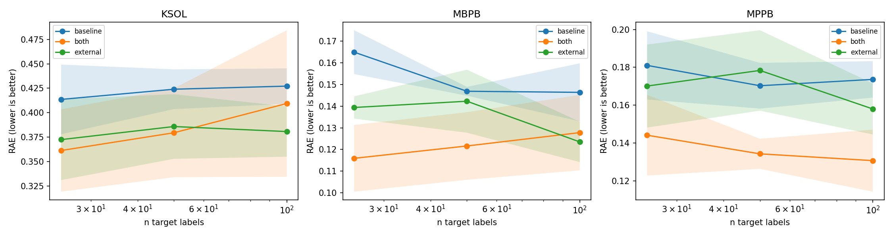
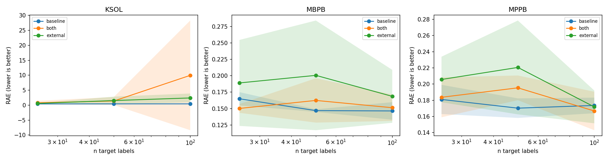

# Further-improvements experiment — real few-shot transfer mechanisms (Aitta agent on LUMI)

Run date: 2026-06-07 · LUMI-G · `project_462001520`.
Self-contained follow-up to the 5-endpoint study in
[`../results-fullexp/EXPERIMENT.md`](../results-fullexp/EXPERIMENT.md). All code/configs/outputs live
in this folder (`further-improvements/`); the original `../src/` and `../results-fullexp/` runs are
**untouched**. TL;DR in [`RESULTS.md`](./RESULTS.md); manual run guide in [`RUNBOOK.md`](./RUNBOOK.md).

## Project context

**Thesis.** The original study mapped *where* transfer helps, but left the **few-shot regime weak**
and flagged `n=25` as unreliable. It also only ever ran two models — `gbm_baseline` and `mt_cotrain`
(from-scratch multitask co-training) — because the two "advanced" transfer mechanisms
(`pretrain_finetune`, `frozen_embed`) were **silent no-ops**: each read a pretrained checkpoint that
nothing in the pipeline ever produced, so both quietly fell back to a from-scratch model. This
experiment **implements real encoder pretraining** and asks whether it lowers few-shot error.

**System.** Same agentic pipeline (Planner → Data agent → ML agent) over the same deterministic
toolset, with one ML-agent change: a new pretraining step (`_pretrain_aux_checkpoint`) trains the
Chemprop v2 encoder on the auxiliary heads (intra-task + harmonized external), saves a checkpoint,
and the two transfer mechanisms now consume it — `pretrain_finetune` fine-tunes the whole model on
the target; `frozen_embed` freezes the encoder and fits a ridge head on its embeddings. The LLM is
**disabled** here (`ADMET_USE_LLM=0`) so the mechanism under test is fixed, not agent-chosen.

**This run** is a controlled head-to-head: the new mechanisms vs the original `mt_cotrain`, on the
three endpoints where the baseline was weak (MBPB, MPPB, KSOL), in the few-shot regime, scored with
paired statistics and the verified official RAE.

## Objective

Quantify whether **real `pretrain_finetune` / `frozen_embed` transfer lowers RAE vs `mt_cotrain`** in
the few-shot regime, with seed-paired significance; and **verify the official RAE** definition by
re-scoring offline from persisted per-molecule predictions.

## Design

Two mechanism sweeps (one per new mechanism), each a full factorial over the weak endpoints:

| Axis | Value |
|---|---|
| Endpoints | `MBPB` (n=975), `MPPB` (n=1302), `KSOL` (n=5128) — the three weak-baseline rounds |
| Arms | `baseline` (LightGBM), `external` (+Biogen), `both` (+intra-task & Biogen) |
| n target labels | 25, 50, 100 — the few-shot regime |
| Seeds | 0,1,2,3,4 |
| Mechanism (transfer arms) | sweep A: `pretrain_finetune` · sweep B: `frozen_embed` |
| Jobs / sweep | 3 × 3 × 3 × 5 = **135** (270 total) |
| Metric | RAE (range-normalized, native scale; **lower is better**) + official RAE (verified) |
| Baseline reference | original `mt_cotrain` numbers from `../results-fullexp/*/results.parquet` |
| LLM | **off** (`ADMET_USE_LLM=0`) — fixed mechanism per arm |

Configs: [`conf/fewshot-pretrain_finetune.yaml`](./conf/fewshot-pretrain_finetune.yaml),
[`conf/fewshot-frozen_embed.yaml`](./conf/fewshot-frozen_embed.yaml).

## Execution / SLURM

Submitted with `scripts/submit_regen.sh` (builds the manifest in-container, then `sbatch`es a strided
array on `small-g`; **array_concurrency 100, max_array_tasks 36**). Predictions persisted to
`<results_dir>/preds/`. Each sweep was de-risked with a 1-job smoke first.

| Job | Array ID | Output |
|---|---|---|
| smoke (external arm) | 19095007 | `results-fewshot/smoke/` |
| smoke (`both` arm — validates the task-dim fix) | 19095114 | `results-fewshot/smoke-both/` |
| sweep A — `pretrain_finetune` | 19095144 | `results-fewshot/pf/` |
| sweep B — `frozen_embed` | 19095180 | `results-fewshot/fe/` |

**Result:** 135/135 jobs per sweep, **0 failures**. The heavy work ran on GPU compute nodes; the
login node only submitted (golden rule). A `both`-arm `pretrain_finetune` job is the slowest (~8 min:
it pretrains on thousands of aux rows then fine-tunes).

---

## Step-by-step reproduction (copy-paste)

Run from project root `/pfs/lustrep1/scratch/project_462001520/Team3/Team3`. Full guide: `RUNBOOK.md`.

```bash
# 1) Smoke one cell on GPU first (validates env + mechanism), then submit the full sweep:
ADMET_USE_LLM=0 bash further-improvements/scripts/submit_regen.sh \
  further-improvements/conf/smoke-fewshot.yaml \
  $PWD/further-improvements/results-fewshot/smoke

# 2) Full mechanism sweeps (GPU; submits and exits — disconnection-safe):
ADMET_USE_LLM=0 bash further-improvements/scripts/submit_regen.sh \
  further-improvements/conf/fewshot-pretrain_finetune.yaml \
  $PWD/further-improvements/results-fewshot/pf
ADMET_USE_LLM=0 bash further-improvements/scripts/submit_regen.sh \
  further-improvements/conf/fewshot-frozen_embed.yaml \
  $PWD/further-improvements/results-fewshot/fe

# 3) Monitor
squeue -u $USER
ls further-improvements/results-fewshot/pf/preds/*.parquet | grep -v meta | wc -l   # of 135

# 4) Analyze (light, in the container — see RUNBOOK §2 for the `csh` helper):
#    official-RAE re-score, paired comparison vs mt_cotrain, plots + report
python further-improvements/scripts/rescore_official.py  --preds-dir .../pf/preds
python further-improvements/scripts/compare_fewshot.py   --new-preds .../pf/preds --label pretrain_finetune
python -m experiment.cli collect --results-dir further-improvements/results-fewshot/pf --metric rae
```

Per-sweep outputs: `results-fewshot/<sweep>/{preds/, pretrain_ckpts/, runs/, results.parquet,
curves.png, ma_rae.png, report.md, logs/}`.

---

## Results

Mean RAE over 5 seeds (lower is better). `mt +ext/+both` = original `mt_cotrain` from
`../results-fullexp`; `pf +ext/+both` = `pretrain_finetune` (this run). **Bold** = lowest in the row.
`*` at n=25: the original transfer arms fell back to `frozen_embed`, which **ignores the auxiliary
data**, so both arms are identical and aux-blind.

### pretrain_finetune — learning curves


### MBPB — sparse (n=975)
| n | baseline | mt +ext | mt +both | pf +ext | pf +both |
|---|---|---|---|---|---|
| 25 | 0.165 | 0.162* | 0.162* | 0.139 | **0.116** |
| 50 | 0.147 | 0.152 | **0.122** | 0.142 | **0.122** |
| 100 | 0.146 | 0.133 | 0.127 | **0.123** | 0.128 |

### MPPB — mid (n=1302)
| n | baseline | mt +ext | mt +both | pf +ext | pf +both |
|---|---|---|---|---|---|
| 25 | 0.181 | 0.205* | 0.205* | 0.170 | **0.144** |
| 50 | 0.170 | 0.179 | 0.152 | 0.178 | **0.134** |
| 100 | 0.174 | 0.152 | 0.144 | 0.158 | **0.131** |

### KSOL — hard, richest (n=5128)
| n | baseline | mt +ext | mt +both | pf +ext | pf +both |
|---|---|---|---|---|---|
| 25 | 0.414 | 0.429* | 0.429* | 0.372 | **0.361** |
| 50 | 0.424 | 0.400 | 0.402 | 0.386 | **0.379** |
| 100 | 0.427 | 0.402 | 0.387 | **0.381** | 0.409 |

### Significance — `pretrain_finetune` vs `mt_cotrain` (paired)

Δ = old − new (positive ⇒ *lower* error); 95% CI from a 10k paired bootstrap over the 5 seeds. Only
the cells where the original ran `mt_cotrain` (n∈{50,100}) can be paired; **significant in 3/12,
never significantly worse**.

| endpoint | arm | n | mt_cotrain | pretrain_finetune | Δ (95% CI) | seeds↑ | sig |
|---|---|---:|---:|---:|---|:--:|:--:|
| KSOL | both | 50 | 0.402 | **0.379** | +0.023 (+0.007, +0.038) | 4/5 | **YES** |
| KSOL | external | 100 | 0.402 | **0.381** | +0.021 (+0.002, +0.041) | 5/5 | **YES** |
| MPPB | both | 50 | 0.152 | **0.134** | +0.018 (+0.003, +0.033) | 4/5 | **YES** |
| MBPB | external | 50 | 0.152 | 0.142 | +0.010 (−0.006, +0.032) | 4/5 | ns |
| MBPB | external | 100 | 0.133 | 0.123 | +0.009 (−0.007, +0.031) | 2/5 | ns |
| MPPB | both | 100 | 0.144 | 0.131 | +0.013 (−0.007, +0.033) | 3/5 | ns |
| KSOL | external | 50 | 0.400 | 0.386 | +0.015 (−0.007, +0.036) | 3/5 | ns |
| others (5 cells) | | | | | within noise | | ns |

### The n=25 "collapse" is resolved

The original flagged `n=25` as unreliable: the transfer arms collapsed to one identical,
high-variance value because the few-shot fallback (`frozen_embed`) ignored the auxiliary data — and
on MPPB/KSOL it was even **worse than the single-task baseline**. `pretrain_finetune` injects the aux
signal through the *encoder* before it ever sees the 25 target labels, so the arms differentiate and
error drops sharply, flipping transfer to net-beneficial:

| endpoint (n=25) | baseline | old transfer (collapsed) | pf +both | pf +external |
|---|---:|---:|---:|---:|
| MBPB | 0.165 | 0.162 | **0.116** (−28%) | 0.139 |
| MPPB | 0.181 | 0.205 *(worse than baseline)* | **0.144** (−30%) | 0.170 |
| KSOL | 0.414 | 0.429 *(worse than baseline)* | **0.361** (−16%) | 0.372 |

(Descriptive, not bootstrapped: the original n=25 arms were a degenerate aux-ignoring fallback, so
there is no matched `mt_cotrain` to pair against.)

### frozen_embed — ruled out


A ridge head on the *frozen* pretrained embeddings is worse in **all 12 cells** and unstable on KSOL,
where RAE blows up (the encoder, pretrained only briefly on aux, is a poor fixed feature extractor
for this hard, wide-range target):

| endpoint | arm | n=25 | n=50 | n=100 | (vs mt_cotrain) |
|---|---|---:|---:|---:|---|
| KSOL | both | 0.793 | 1.389 | 9.959 | catastrophic |
| MBPB | both | 0.150 | 0.162 | 0.151 | worse |
| MPPB | both | 0.184 | 0.195 | 0.167 | worse |

Clean negative result: for these endpoints the encoder must **adapt** to the target assay —
fine-tuning beats freezing.

### Official RAE — verified
Re-scoring every cell offline from the persisted predictions (`rescore_official.py`) gives
**`max |official − range_normalized| = 0.00e+00`** on both sweeps. So all RAE numbers here (and the
headline percentages in the original `EXPERIMENT.md`) **are** the challenge-scoring RAE — confirmed,
not assumed. The `official` branch is no longer a stub.

### Takeaways

1. **Real pretraining is a genuine few-shot win.** `pretrain_finetune` significantly lowers RAE in
   3/12 paired cells (KSOL both/ext, MPPB both at n=50–100) and is **never significantly worse**.
   Gains are modest in magnitude (~0.02 RAE) but real and seed-paired.
2. **It fixes the documented n=25 collapse.** Pretraining the encoder on auxiliary data turns the
   smallest-data regime from net-harmful (vs baseline) to net-beneficial, and differentiates the arms
   that previously collapsed.
3. **Freezing the encoder doesn't work here.** `frozen_embed` is uniformly worse and unstable on
   KSOL — a useful negative result that rules out the cheap shortcut.
4. **The metric is verified.** Persisted predictions + offline re-scoring confirm `official ==
   range_normalized` exactly, closing the credibility gap the original doc left open.

**Decision rule (updated):** in the data-poor regime (n≤50) of a weak-baseline endpoint, prefer
`pretrain_finetune` over from-scratch co-training — it captures the aux signal even when target
labels are too few for co-training to differentiate; do not freeze the encoder.

---

## Methods / validation notes

- **Real pretraining.** `MLAgent._pretrain_aux_checkpoint` pretrains on the **full** multitask head
  restricted to aux-labeled rows (so `n_tasks` matches fine-tune time and the checkpoint reloads
  without a task-dimension mismatch — a bug we hit and fixed; see `RUNBOOK.md` §9).
- **Paired statistics.** `compare_fewshot.py` joins new vs original on `(endpoint, arm, n, seed)` and
  bootstraps the per-seed delta (10k resamples). Honest caveat: n=5 seeds, so CIs are wide;
  molecule-level CIs are available via `bootstrap_lift_molecule.py` on the persisted preds.
- **Controlled mechanism.** LLM disabled, so each arm uses exactly the configured mechanism (no
  agent override) — required for a clean A/B.
- **Reproducibility.** Every run persists native-scale `(y_true, y_pred)` + metadata, so any metric
  or test is recomputable offline with no retraining.

## Appendix — pointers

- Patch details (what changed in `src/`): [`IMPLEMENTATION.md`](./IMPLEMENTATION.md) (Patch 4).
- Manual operations: [`RUNBOOK.md`](./RUNBOOK.md).
- Raw analysis tables: `outputs/compare_pretrain_finetune.csv`, `outputs/compare_frozen_embed.csv`,
  `outputs/rescore_pf.csv`, `outputs/rescore_fe.csv`.
- Per-sweep aggregates + plots: `results-fewshot/{pf,fe}/{results.parquet, curves.png, ma_rae.png,
  report.md}`.
- Per-molecule predictions (for re-scoring / molecule-level stats):
  `results-fewshot/{pf,fe}/preds/`.
