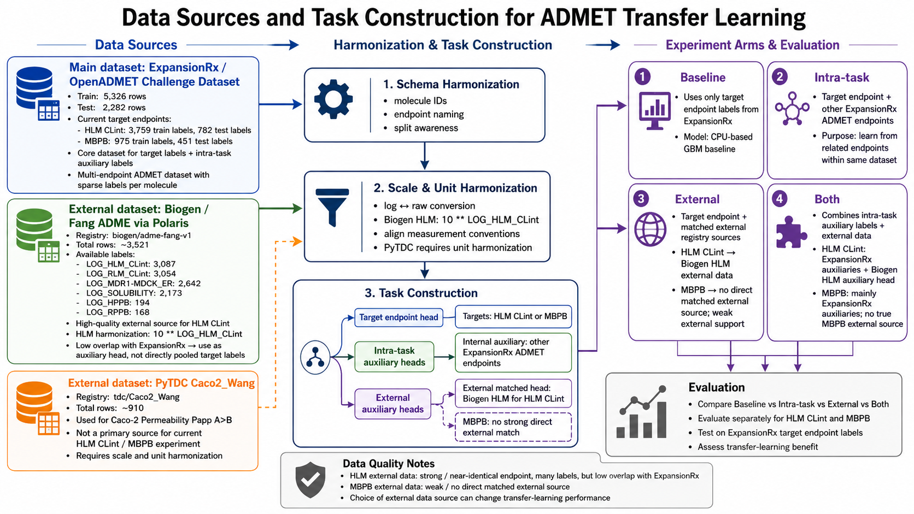
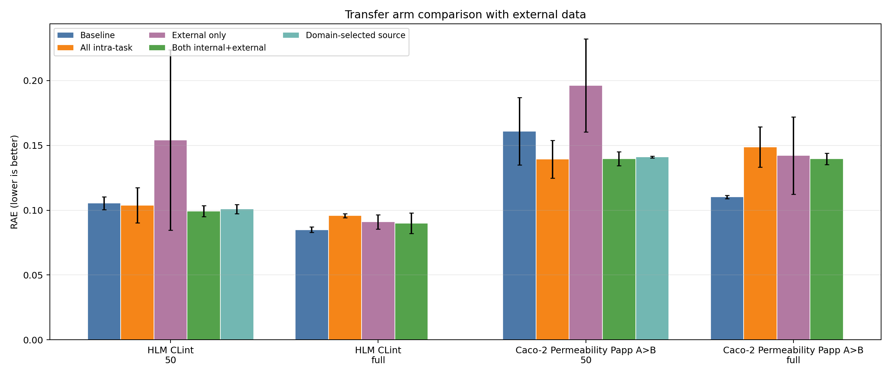
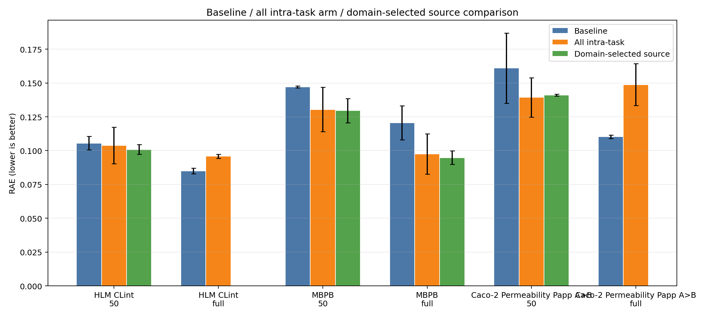
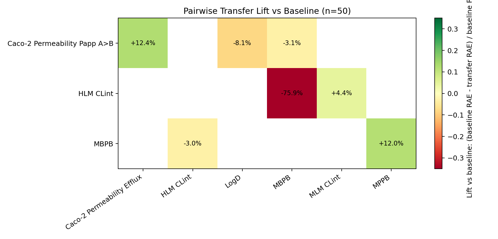
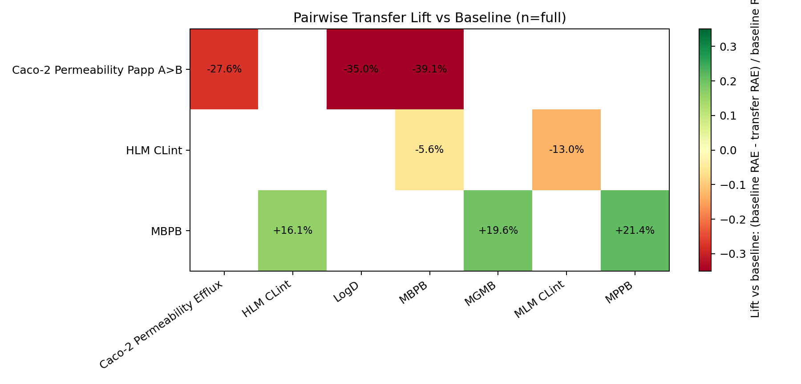
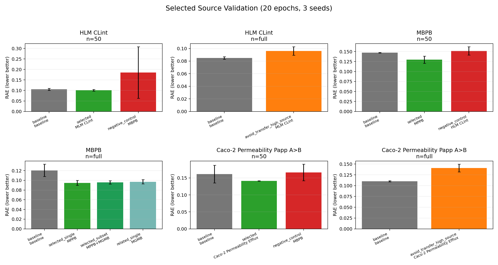

# ADMET Transfer Learning Extension Results

Run date: 2026-06-07. Local CPU reproduction and source-selection extension by QQX.

This folder contains QQX's local reproduction and extension of the Team3 ADMET transfer-learning workflow.

## Objective

Characterize **when auxiliary-data transfer helps ADMET prediction locally**, with emphasis on:

- low-label transfer behavior,
- full-data behavior,
- source-task interpretability,
- negative transfer,
- external-data quality and harmonization.

The local extension was designed to answer:

```text
Which source tasks help each ADMET target, and when does transfer hurt?
```

## Prediction Task

Each ADMET endpoint is modeled as:

```text
Input: molecule SMILES
Model: molecular featurizer or Chemprop graph encoder
Output: one target endpoint value
```

Example:

```text
SMILES -> molecular representation -> HLM CLint prediction
```

In the multi-task settings, auxiliary endpoints are used as **training-time labels**, not prediction-time input features. At prediction time, the model still uses only molecule SMILES to predict the target endpoint.

## Target Endpoints

| Endpoint | Biological category | Why included |
|---|---|---|
| HLM CLint | Metabolism | Strong baseline and matched Biogen HLM external data |
| MBPB | Brain/tissue binding | Transfer effects are clearer than HLM |
| Caco-2 Papp A>B | Permeability | Adds a membrane/permeability endpoint and links to LogD, KSOL, and Efflux |

## Design

### Label Budgets

This local extension uses:

```text
n target labels = 50, full
seeds = 0, 1, 2
```

The local design compares:

- **few-shot** behavior at `n=50`,
- **full-data** behavior when all target labels are available.

This gives a clean answer to whether transfer mainly helps when target labels are scarce.

### Experiment Arms

| Arm | Training input and labels | Purpose |
|---|---|---|
| Baseline | SMILES + target labels only from ExpansionRx | No-transfer reference |
| Intra-task | Target labels + other ExpansionRx ADMET endpoints as auxiliary labels | Test whether internal multi-task learning helps |
| External | Target labels + matched external auxiliary dataset | Test external transfer |
| Both | Target labels + internal auxiliary endpoints + external auxiliary dataset | Test whether internal tasks stabilize external transfer |
| Pairwise source | Target + one selected source endpoint | Identify good and bad source tasks |
| Domain-selected source | Target + source selected from pairwise/domain knowledge | Validate interpretable source selection |

### Main Matched Arm Runs

These runs compare broad transfer strategies.

| Run block | Endpoints | Arms | n target labels | Seeds | Jobs | Output source |
|---|---|---|---|---|---:|---|
| Baseline + intra-task | HLM CLint, MBPB, Caco-2 Papp A>B | `baseline`, `intra_task` | 50, full | 0,1,2 | 36 | `results_matched_baseline_intra_20ep` |
| External + both | HLM CLint, Caco-2 Papp A>B | `external`, `both` | 50, full | 0,1,2 | 24 | `results_external_both_matched_20ep` |

MBPB was excluded from the external/both run because the local registry did not contain a strong direct MBPB external source. Running `MBPB external` would not be a meaningful external-data test.

### Pairwise Source-Task Run

The pairwise run tests one source endpoint at a time:

```text
target + one source
```

| Target | Tested source tasks | n target labels | Seeds | Jobs |
|---|---|---|---|---:|
| HLM CLint | MLM CLint, MBPB | 50, full | 0,1,2 | 18 |
| MBPB | MPPB, MGMB, HLM CLint | 50, full | 0,1,2 | 24 |
| Caco-2 Papp A>B | Caco-2 Efflux, LogD, MBPB | 50, full | 0,1,2 | 24 |

Total pairwise jobs: **66**.

This run is different from `intra_task`: instead of using all other endpoints together, it asks which **individual** source endpoint helps or hurts each target.

### Selected-Source Validation

After pairwise analysis, selected sources were compared against baseline and all-intra-task transfer.

| Target | Selected source setting | Purpose |
|---|---|---|
| HLM CLint, n=50 | MLM CLint | Validate a related metabolism source |
| MBPB | MPPB; MPPB+MGMB | Validate protein-binding source selection |
| Caco-2 Papp A>B, n=50 | Caco-2 Efflux | Validate permeability-related transfer |

The selected-source validation supports the idea that a future agent should choose source tasks selectively instead of always using all endpoints.

## Model and Evaluation Settings

| Axis | Value |
|---|---|
| Local run type | Local reproduction / extension |
| Baseline model | LightGBM over molecular fingerprints/features |
| Transfer model | Chemprop v2 multi-task model |
| Chemprop epochs | 20 |
| Main metric | RAE, lower is better |
| Additional metrics | MAE, RMSE, R2, Spearman |
| Evaluation split | Fixed ExpansionRx held-out test split |
| Seeds | 0, 1, 2 |
| LLM agent | Not used in this local extension |

The workflow uses deterministic project modules such as `DataAgent`, `MLAgent`, planner/runner, and evaluator. This extension does **not** yet implement a true LLM `agent-selected source` arm. The source-selection logic here is domain-guided and experiment-driven.

## Job Summary

| Block | Jobs launched | Valid jobs used in aggregation | Notes |
|---|---:|---:|---|
| Baseline + intra-task | 36 | 36 | 3 endpoints x 2 arms x 2 n settings x 3 seeds |
| External + both | 24 | 23 | One Caco external-only n=50 seed produced NaN metrics |
| Pairwise source-task | 66 | 66 | Internal source-target pairs only |
| Selected-source validation | 3 new multi-source jobs plus reused pairwise/baseline summaries | 3 | Focused validation of MBPB MPPB+MGMB subset |

## Data Sources



| Dataset | Role | Notes |
|---|---|---|
| ExpansionRx / OpenADMET Challenge Dataset | Main dataset | Contains target endpoints and internal auxiliary endpoints |
| Biogen/Fang ADME via Polaris | External HLM source | Near-identical HLM endpoint, but zero molecule overlap with ExpansionRx, so used as an auxiliary head |
| TDC Caco2_Wang | External Caco-2 source | Permeability-related external source, weaker match and one unstable seed |

## Result 1: Full Transfer Arm Comparison



| Target | n | Method | Source setting | Valid seeds | RAE mean +/- std | Lift vs baseline |
|---|---:|---|---|---:|---:|---:|
| HLM CLint | 50 | Baseline | target only | 3 | 0.1055 +/- 0.0050 | +0.0% |
| HLM CLint | 50 | All intra-task | all other ExpansionRx endpoints | 3 | 0.1038 +/- 0.0135 | +1.6% |
| HLM CLint | 50 | External only | Biogen HLM auxiliary | 3 | 0.1542 +/- 0.0695 | -46.2% |
| HLM CLint | 50 | Both internal+external | internal auxiliaries + Biogen HLM | 3 | 0.0992 +/- 0.0043 | +5.9% |
| HLM CLint | 50 | Domain-selected source | MLM CLint | 3 | 0.1009 +/- 0.0036 | +4.4% |
| HLM CLint | full | Baseline | target only | 3 | 0.0850 +/- 0.0021 | +0.0% |
| HLM CLint | full | All intra-task | all other ExpansionRx endpoints | 3 | 0.0958 +/- 0.0015 | -12.7% |
| HLM CLint | full | External only | Biogen HLM auxiliary | 3 | 0.0910 +/- 0.0055 | -7.1% |
| HLM CLint | full | Both internal+external | internal auxiliaries + Biogen HLM | 3 | 0.0899 +/- 0.0079 | -5.8% |
| Caco-2 Papp A>B | 50 | Baseline | target only | 3 | 0.1610 +/- 0.0260 | +0.0% |
| Caco-2 Papp A>B | 50 | All intra-task | all other ExpansionRx endpoints | 3 | 0.1393 +/- 0.0145 | +13.5% |
| Caco-2 Papp A>B | 50 | External only | TDC Caco2_Wang auxiliary | 2 | 0.1962 +/- 0.0359 | -21.8% |
| Caco-2 Papp A>B | 50 | Both internal+external | internal auxiliaries + TDC Caco2_Wang | 3 | 0.1397 +/- 0.0054 | +13.3% |
| Caco-2 Papp A>B | 50 | Domain-selected source | Caco-2 Efflux | 3 | 0.1411 +/- 0.0007 | +12.4% |
| Caco-2 Papp A>B | full | Baseline | target only | 3 | 0.1103 +/- 0.0012 | +0.0% |
| Caco-2 Papp A>B | full | All intra-task | all other ExpansionRx endpoints | 3 | 0.1488 +/- 0.0155 | -35.0% |
| Caco-2 Papp A>B | full | External only | TDC Caco2_Wang auxiliary | 3 | 0.1422 +/- 0.0299 | -28.9% |
| Caco-2 Papp A>B | full | Both internal+external | internal auxiliaries + TDC Caco2_Wang | 3 | 0.1396 +/- 0.0045 | -26.6% |

Key interpretation:

- Transfer learning is most useful in low-label settings (`n=50`).
- HLM CLint full-data baseline remains strongest.
- Caco-2 Papp A>B benefits from internal/both transfer at `n=50`, but transfer hurts in full-data.
- External-only transfer is not automatically useful. `both` is more stable than external-only because internal auxiliary endpoints help stabilize the weaker external signal.

## Result 2: Baseline / Intra-task / Domain-selected Source



| Target | n | Method | Source setting | Valid seeds | RAE mean +/- std | Lift vs baseline |
|---|---:|---|---|---:|---:|---:|
| HLM CLint | 50 | Baseline | target only | 3 | 0.1055 +/- 0.0050 | +0.0% |
| HLM CLint | 50 | All intra-task | all other ExpansionRx endpoints | 3 | 0.1038 +/- 0.0135 | +1.6% |
| HLM CLint | 50 | Domain-selected source | MLM CLint | 3 | 0.1009 +/- 0.0036 | +4.4% |
| HLM CLint | full | Baseline | target only | 3 | 0.0850 +/- 0.0021 | +0.0% |
| HLM CLint | full | All intra-task | all other ExpansionRx endpoints | 3 | 0.0958 +/- 0.0015 | -12.7% |
| MBPB | 50 | Baseline | target only | 3 | 0.1472 +/- 0.0007 | +0.0% |
| MBPB | 50 | All intra-task | all other ExpansionRx endpoints | 3 | 0.1305 +/- 0.0165 | +11.4% |
| MBPB | 50 | Domain-selected source | MPPB | 3 | 0.1295 +/- 0.0089 | +12.0% |
| MBPB | full | Baseline | target only | 3 | 0.1206 +/- 0.0127 | +0.0% |
| MBPB | full | All intra-task | all other ExpansionRx endpoints | 3 | 0.0975 +/- 0.0148 | +19.1% |
| MBPB | full | Domain-selected source | MPPB | 3 | 0.0948 +/- 0.0050 | +21.4% |
| Caco-2 Papp A>B | 50 | Baseline | target only | 3 | 0.1610 +/- 0.0260 | +0.0% |
| Caco-2 Papp A>B | 50 | All intra-task | all other ExpansionRx endpoints | 3 | 0.1393 +/- 0.0145 | +13.5% |
| Caco-2 Papp A>B | 50 | Domain-selected source | Caco-2 Efflux | 3 | 0.1411 +/- 0.0007 | +12.4% |
| Caco-2 Papp A>B | full | Baseline | target only | 3 | 0.1103 +/- 0.0012 | +0.0% |
| Caco-2 Papp A>B | full | All intra-task | all other ExpansionRx endpoints | 3 | 0.1488 +/- 0.0155 | -35.0% |

Key interpretation:

- Domain-selected sources are competitive with all-intra-task transfer.
- MBPB benefits most clearly from the domain-related source `MPPB`.
- HLM full-data and Caco full-data should avoid transfer in this local setting.

## Result 3: Pairwise Source-Task Analysis

Pairwise transfer tests:

```text
target + one source
```





| Target | n | Source | Priority | Valid seeds | RAE mean +/- std | Lift vs baseline |
|---|---:|---|---|---:|---:|---:|
| Caco-2 Papp A>B | 50 | Caco-2 Efflux | high | 3 | 0.1411 +/- 0.0007 | +12.4% |
| Caco-2 Papp A>B | 50 | LogD | medium | 3 | 0.1740 +/- 0.0121 | -8.1% |
| Caco-2 Papp A>B | 50 | MBPB | low_control | 3 | 0.1661 +/- 0.0243 | -3.1% |
| Caco-2 Papp A>B | full | Caco-2 Efflux | high | 3 | 0.1407 +/- 0.0089 | -27.6% |
| Caco-2 Papp A>B | full | LogD | medium | 3 | 0.1488 +/- 0.0119 | -35.0% |
| Caco-2 Papp A>B | full | MBPB | low_control | 3 | 0.1534 +/- 0.0260 | -39.1% |
| HLM CLint | 50 | MBPB | low_control | 3 | 0.1856 +/- 0.1226 | -75.9% |
| HLM CLint | 50 | MLM CLint | high | 3 | 0.1009 +/- 0.0036 | +4.4% |
| HLM CLint | full | MBPB | low_control | 3 | 0.0897 +/- 0.0039 | -5.6% |
| HLM CLint | full | MLM CLint | high | 3 | 0.0961 +/- 0.0067 | -13.0% |
| MBPB | 50 | HLM CLint | low_control | 3 | 0.1516 +/- 0.0103 | -3.0% |
| MBPB | 50 | MGMB | high | 0 | invalid | n/a |
| MBPB | 50 | MPPB | high | 3 | 0.1295 +/- 0.0089 | +12.0% |
| MBPB | full | HLM CLint | low_control | 3 | 0.1012 +/- 0.0131 | +16.1% |
| MBPB | full | MGMB | high | 3 | 0.0970 +/- 0.0044 | +19.6% |
| MBPB | full | MPPB | high | 3 | 0.0948 +/- 0.0050 | +21.4% |

Key interpretation:

- `MBPB <- MPPB` is the clearest helpful source relationship.
- `Caco-2 Papp A>B <- Caco-2 Efflux` helps in few-shot but not full-data.
- `HLM CLint <- MBPB` is a strong negative-transfer example.
- Pairwise transfer explains why "use all sources" is not always the best strategy.

## Result 4: Selected-Source Validation



| Target | n | Role | Source | Valid seeds | RAE mean +/- std | Lift vs baseline |
|---|---:|---|---|---:|---:|---:|
| HLM CLint | 50 | baseline | baseline | 3 | 0.1055 +/- 0.0050 | +0.0% |
| HLM CLint | 50 | selected | MLM CLint | 3 | 0.1009 +/- 0.0036 | +4.4% |
| HLM CLint | 50 | negative control | MBPB | 3 | 0.1856 +/- 0.1226 | -75.9% |
| HLM CLint | full | baseline | baseline | 3 | 0.0850 +/- 0.0021 | +0.0% |
| HLM CLint | full | avoid transfer | MLM CLint | 3 | 0.0961 +/- 0.0067 | -13.0% |
| MBPB | 50 | baseline | baseline | 3 | 0.1472 +/- 0.0007 | +0.0% |
| MBPB | 50 | selected | MPPB | 3 | 0.1295 +/- 0.0089 | +12.0% |
| MBPB | 50 | negative control | HLM CLint | 3 | 0.1516 +/- 0.0103 | -3.0% |
| MBPB | full | baseline | baseline | 3 | 0.1206 +/- 0.0127 | +0.0% |
| MBPB | full | selected single | MPPB | 3 | 0.0948 +/- 0.0050 | +21.4% |
| MBPB | full | selected subset | MPPB+MGMB | 3 | 0.0959 +/- 0.0034 | +20.5% |
| MBPB | full | related single | MGMB | 3 | 0.0970 +/- 0.0044 | +19.6% |
| Caco-2 Papp A>B | 50 | baseline | baseline | 3 | 0.1610 +/- 0.0260 | +0.0% |
| Caco-2 Papp A>B | 50 | selected | Caco-2 Efflux | 3 | 0.1411 +/- 0.0007 | +12.4% |
| Caco-2 Papp A>B | 50 | negative control | MBPB | 3 | 0.1661 +/- 0.0243 | -3.1% |
| Caco-2 Papp A>B | full | baseline | baseline | 3 | 0.1103 +/- 0.0012 | +0.0% |
| Caco-2 Papp A>B | full | avoid transfer | Caco-2 Efflux | 3 | 0.1407 +/- 0.0089 | -27.6% |

Key interpretation:

- The selected source is not always more complex; often it is just a biologically related single source.
- `MPPB` is a strong and interpretable source for `MBPB`.
- Adding more related sources (`MPPB+MGMB`) did not beat `MPPB` alone in this local validation.

## Result 5: Source-Selection Decision Table

| Target | Regime | Recommended | Avoid | Decision |
|---|---|---|---|---|
| HLM CLint | n=50 | MLM CLint | MBPB | Use metabolism-related source only in few-shot |
| HLM CLint | full | baseline / no transfer | MLM, MBPB | Baseline already strong; transfer adds noise |
| MBPB | n=50 | MPPB | HLM CLint | Plasma/brain binding relation is useful |
| MBPB | full | MPPB; MPPB+MGMB comparable | none clear | Binding/tissue sources consistently help |
| Caco-2 Papp A>B | n=50 | Caco-2 Efflux | MBPB | Permeability-related source helps in few-shot |
| Caco-2 Papp A>B | full | baseline / no transfer | Efflux, LogD, MBPB | Full target data beats tested transfer sources |

## Files

| Path | Description |
|---|---|
| `figures/` | Main plots and workflow visualization |
| `tables/full_transfer_arm_comparison.csv` | Combined baseline, intra-task, external, both, and selected-source comparison |
| `tables/baseline_intra_vs_domain_selected.csv` | Baseline, intra-task, and domain-selected comparison |
| `tables/pairwise_summary.csv` | Pairwise source-target transfer summary |
| `tables/best_pairwise_source.csv` | Best source per target and label regime |
| `tables/selected_source_validation_summary.csv` | Domain-selected source validation |
| `tables/source_selection_decision_table.csv` | Recommended source-selection rules |
| `configs/` | YAML configs used for matched local runs |
| `notes/` | Detailed run-specific reports generated during the local workflow |

## Reproducibility Notes

- Local run type: CPU/local reproduction and focused extension.
- Chemprop transfer arms: 20 epochs.
- Seeds: 3 seeds where valid.
- Metrics: RAE, MAE, RMSE, R2, and Spearman.
- One Caco external-only `n=50` seed produced NaN metrics and was excluded from aggregated valid-seed results.
- This folder contains summarized outputs only. Per-run JSON files, full logs, virtual environments, and raw datasets were intentionally not uploaded.

## High-Level Conclusion

This extension shows that ADMET transfer learning is useful when source tasks are related and target labels are limited. However, blindly adding all internal or external data can create negative transfer. A source-aware workflow, potentially implemented as an agent-selected source module, is a useful next step for the Team3 project.
