# Full experiment — 5-endpoint ADMET transfer study (Aitta agent on LUMI)

Run date: 2026-06-06 · LUMI-G · `project_462001520`.
Self-contained, separate from earlier runs (`results/`, `results-rounds/`); nothing here depends
on previous results. Companion docs: [OVERVIEW.md](../OVERVIEW.md), [Readme.md](../Readme.md),
[CHEMPROP_STABILITY.md](../CHEMPROP_STABILITY.md).

## Objective

Characterize **where, and from what source, auxiliary-data transfer helps few-shot ADMET
prediction**, across **five endpoints spanning the data-richness spectrum** and three external
match types. Each endpoint is a full sweep (4 arms × 6 data sizes × 5 seeds), run by the standalone
Aitta agent loop (Planner → Data agent → ML agent → Planner report).

## Design

5 rounds (one endpoint each), all run as **parallel SLURM arrays** with a dependent collect job:

| Round | Endpoint | Labels (train) | External source | Match quality |
|---|---|---:|---|---|
| hlm | `HLM CLint` | 3759 | Biogen `LOG_HLM_CLint` | near-identical |
| mbpb | `MBPB` | 975 | Biogen `LOG_HPPB` | species-transfer (weak) |
| ksol | `KSOL` | 5128 | Biogen `LOG_SOLUBILITY` | protocol-caveat (µg/mL→µM) |
| mppb | `MPPB` | 1302 | Biogen `LOG_HPPB` | species-transfer |
| caco2eff | `Caco-2 Permeability Efflux` | 2161 | Biogen `LOG_MDR1-MDCK_ER` | analogous (diff. cell line) |

Arms: `baseline` (LightGBM single-task), `+ intra_task` (Chemprop multitask on ExpansionRx aux
endpoints), `+ external` (multitask on the harmonized external source), `+ both`.

| Axis | Value |
|---|---|
| n target labels | 25, 50, 100, 250, 500, **full** |
| Seeds | 0,1,2,3,4 → mean RAE ± std |
| Jobs / round | 4 × 6 × 5 = **120** (600 total) |
| Metric | RAE (range-normalized, native scale; **lower is better**) |
| Models | `baseline`→LightGBM; transfer arms→Chemprop v2 multitask |
| Eval | fixed held-out ExpansionRx test split, scored once |
| LLM | Aitta `openai/gpt-oss-120b`; decisions cached at `results/llm_cache` |

## Execution / SLURM

Launched with `scripts/run_fullexp.sh` using `conf/slurm-fullexp.yaml`:
**array_concurrency: 100**, `max_array_tasks: 36` → each round = 36 array tasks striding 4 jobs;
5 rounds × 36 + 5 collect = **185 submitted jobs** (under LUMI small-g's ~200 limit), with up to
~180 GPU jobs running concurrently across the five arrays.

Job IDs are recorded in [`JOBIDS.txt`](JOBIDS.txt). At submit time:

| Round | Sweep | Collect (afterany) | Output |
|---|---|---|---|
| hlm | 19073763 | 19073764 | `results-fullexp/hlm/` |
| mbpb | 19073778 | 19073779 | `results-fullexp/mbpb/` |
| ksol | 19073780 | 19073781 | `results-fullexp/ksol/` |
| mppb | 19073782 | 19073783 | `results-fullexp/mppb/` |
| caco2eff | 19073786 | 19073787 | `results-fullexp/caco2eff/` |

**Disconnection-safe:** the launcher only submits, then exits; SLURM runs the sweeps and the
chained collect jobs independently of any login session. You can log out immediately after
submitting and the reports + plots will still be produced.

---

## Step-by-step reproduction (copy-paste)

Run from the project root on a **LUMI login node**. Everything is standalone.

```bash
# 0) One-time: get a 24h Aitta token from https://aitta-auth.csc.fi/myToken
echo 'PASTE_YOUR_TOKEN_HERE' > conf/.aitta_token && chmod 600 conf/.aitta_token

# 1) Preflight: confirm Aitta is reachable and the plan enumerates (no jobs launched)
bash scripts/run_agent.sh --check

# 2) (optional) Preview what will be submitted — renders sbatch scripts, submits nothing
bash scripts/run_fullexp.sh --dry-run

# 3) Launch the full 5-round experiment (disconnection-safe; logs out fine after this)
nohup bash scripts/run_fullexp.sh &>results-fullexp/submit.log &
#    ...or simply:  bash scripts/run_fullexp.sh

# 4) Monitor (any time, from any session)
squeue -u $USER                 # R = running, blank = done
bash scripts/check_status.sh    # higher-level progress
cat results-fullexp/JOBIDS.txt  # the sweep/collect job ids per round

# 5) Read each round's result when its collect job finishes
cat results-fullexp/hlm/report.md
cat results-fullexp/mbpb/report.md
cat results-fullexp/ksol/report.md
cat results-fullexp/mppb/report.md
cat results-fullexp/caco2eff/report.md

# 6) (only if needed) re-aggregate one round's report without re-training
#    (e.g. after a tweak); standalone, no GPU:
RESULTS_DIR=results-fullexp/ksol bash scripts/submit_collect.sh
```

Config files for this experiment (edit to change scope):
`conf/fullexp-{hlm,mbpb,ksol,mppb,caco2eff}.yaml`, `conf/slurm-fullexp.yaml`,
launcher `scripts/run_fullexp.sh`.

Per-round outputs: `results-fullexp/<round>/{results.parquet, curves.png, ma_rae.png, report.md, runs/}`.

---

## Results

All 600 jobs completed (no failures). Tables show **mean RAE ± std over 5 seeds** (lower is
better); **bold** = best arm at that data size. Arms: `+intra` = ExpansionRx multitask,
`+external` = Biogen multitask, `+both` = both auxiliary sources.

### hlm — HLM CLint (rich, n=3759)
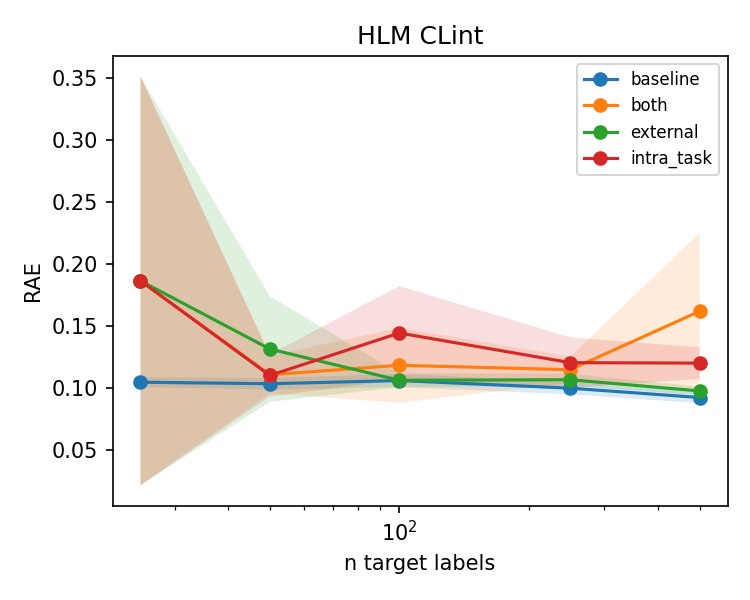

| n | baseline | +intra | +external | +both |
|---|---|---|---|---|
| 25 | **0.105±0.004** | 0.187±0.165 | 0.187±0.165 | 0.187±0.165 |
| 50 | **0.104±0.005** | 0.110±0.017 | 0.132±0.042 | 0.111±0.015 |
| 100 | **0.106±0.005** | 0.145±0.038 | 0.107±0.006 | 0.119±0.030 |
| 250 | **0.100±0.005** | 0.121±0.020 | 0.107±0.005 | 0.115±0.011 |
| 500 | **0.093±0.005** | 0.120±0.013 | 0.098±0.004 | 0.162±0.063 |
| full | **0.085±0.002** | 0.134±0.052 | 0.093±0.007 | 0.122±0.019 |

Single-task LightGBM wins at **every** size — HLM CLint already has enough labels that transfer
only adds noise. Negative result (transfer is the wrong move here).

### mbpb — MBPB (sparse, n=975)
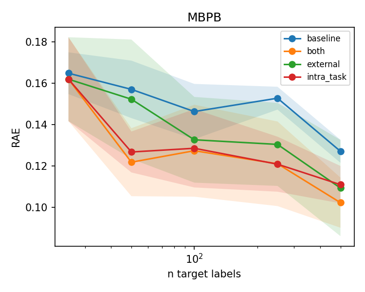

| n | baseline | +intra | +external | +both |
|---|---|---|---|---|
| 25 | 0.165±0.010 | **0.162±0.020** | 0.162±0.020 | 0.162±0.020 |
| 50 | 0.157±0.014 | 0.127±0.010 | 0.152±0.029 | **0.122±0.016** |
| 100 | 0.146±0.013 | 0.129±0.019 | 0.133±0.021 | **0.127±0.022** |
| 250 | 0.153±0.006 | **0.121±0.013** | 0.130±0.020 | 0.121±0.020 |
| 500 | 0.127±0.006 | 0.111±0.009 | 0.109±0.023 | **0.102±0.012** |
| full | 0.121±0.011 | 0.100±0.009 | **0.096±0.008** | 0.103±0.016 |

Transfer helps strongly and consistently (≈20–22%), including at full data. Best low-data arm
combines both sources; external alone is best at full.

### ksol — KSOL (richest, n=5128)
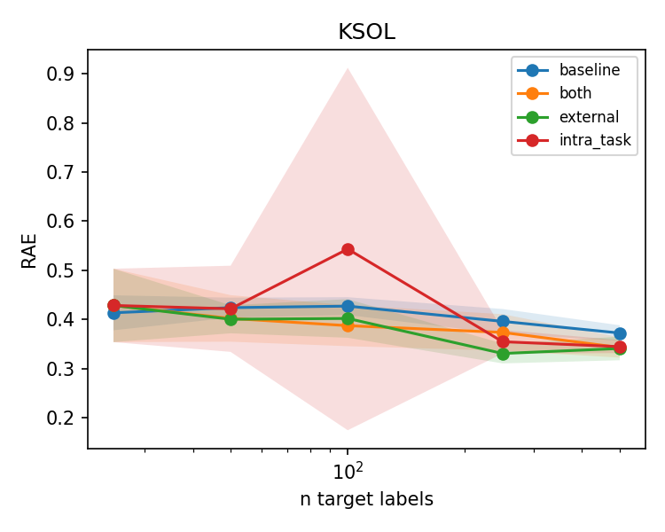

| n | baseline | +intra | +external | +both |
|---|---|---|---|---|
| 25 | **0.414±0.036** | 0.429±0.075 | 0.429±0.075 | 0.429±0.075 |
| 50 | 0.424±0.020 | 0.422±0.088 | **0.400±0.029** | 0.402±0.047 |
| 100 | 0.427±0.018 | 0.543±0.369 | 0.402±0.039 | **0.387±0.042** |
| 250 | 0.396±0.025 | 0.355±0.024 | **0.331±0.020** | 0.374±0.037 |
| 500 | 0.372±0.016 | 0.345±0.013 | **0.341±0.024** | 0.343±0.021 |
| full | 0.329±0.008 | 0.310±0.014 | **0.270±0.013** | 0.287±0.009 |

High absolute RAE (KSOL is intrinsically hard), but the harmonized Biogen solubility source is the
best arm from n=250 upward and cuts RAE **18%** at full data — the unit conversion (µg/mL→µM) paid off.

### mppb — MPPB (mid, n=1302)
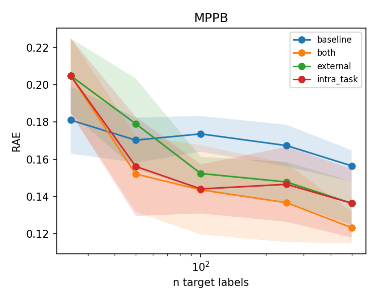

| n | baseline | +intra | +external | +both |
|---|---|---|---|---|
| 25 | **0.181±0.018** | 0.205±0.020 | 0.205±0.020 | 0.205±0.020 |
| 50 | 0.170±0.012 | 0.156±0.027 | 0.179±0.024 | **0.152±0.020** |
| 100 | 0.174±0.010 | 0.144±0.013 | 0.152±0.009 | **0.144±0.024** |
| 250 | 0.167±0.011 | 0.147±0.020 | 0.148±0.011 | **0.137±0.021** |
| 500 | 0.156±0.008 | 0.136±0.018 | 0.136±0.012 | **0.123±0.008** |
| full | 0.161±0.002 | 0.127±0.015 | **0.118±0.012** | 0.129±0.009 |

Largest transfer payoff of the study: external human-PPB cuts RAE **27%** at full data; `+both`
leads through the few-shot/mid regime.

### caco2eff — Caco-2 Permeability Efflux (mid, n=2161)
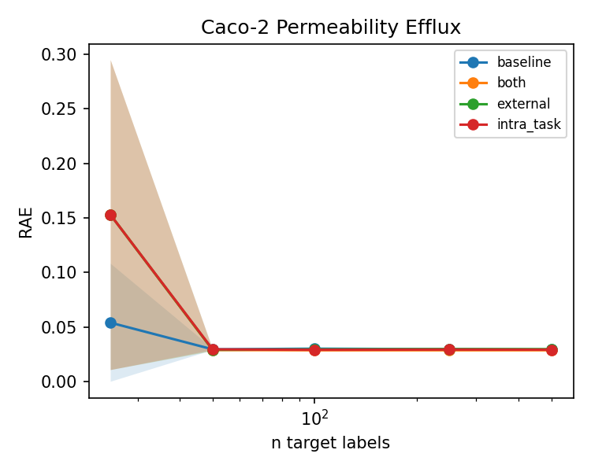

| n | baseline | +intra | +external | +both |
|---|---|---|---|---|
| 25 | **0.054±0.054** | 0.153±0.142 | 0.153±0.142 | 0.153±0.142 |
| 50 | 0.030±0.001 | 0.029±0.001 | 0.029±0.001 | **0.029±0.001** |
| 100 | 0.030±0.000 | 0.029±0.000 | 0.029±0.001 | **0.029±0.001** |
| 250 | 0.030±0.001 | 0.029±0.001 | 0.030±0.000 | **0.029±0.001** |
| 500 | 0.029±0.001 | 0.029±0.001 | 0.030±0.001 | **0.029±0.001** |
| full | 0.028±0.000 | 0.029±0.001 | 0.029±0.001 | **0.028±0.000** |

Effectively a ceiling case — every arm reaches RAE ≈0.03 by n=50, so there is no headroom for
transfer to exploit (the n=25 baseline's 0.054±0.054 is a single-seed fluke, note the variance).

### Cross-round synthesis

Best transfer arm vs. baseline (negative % = transfer worse; positive = transfer better):

| Endpoint | Labels | few-shot (n=50) | full data |
|---|---:|---|---|
| HLM CLint | 3759 | +intra **−6.4%** (baseline wins) | +external **−9.2%** (baseline wins) |
| Caco-2 Efflux | 2161 | +both +2.1% | +both +1.0% |
| MPPB | 1302 | +both **+10.7%** | +external **+26.9%** |
| MBPB | 975 | +both **+22.4%** | +external **+20.9%** |
| KSOL | 5128 | +external +5.6% | +external **+18.0%** |

**Takeaways**

1. **Transfer value tracks baseline headroom, not raw data size.** Where single-task LightGBM is
   already strong, transfer is neutral-to-harmful: HLM CLint (baseline best at every n) and the
   near-saturated Caco-2 Efflux (everything ≈0.03). Where the baseline is weak — MBPB, MPPB, and the
   intrinsically hard KSOL — multitask transfer delivers large, repeatable gains (≈18–27%).
2. **External assays carry real signal even with imperfect match.** At full data the **external
   Biogen source is the single best arm in 3/5 rounds** (MBPB, KSOL, MPPB) and second on HLM. This
   holds despite only species-transfer (MBPB/MPPB) or protocol-caveat (KSOL) matches, validating the
   agent's harmonization (incl. the KSOL µg/mL→µM conversion).
3. **In the few-shot regime, combine sources.** `+both` is the best arm at n=50 for MBPB, MPPB and
   Caco-2; intra-task ExpansionRx co-training is the safer early signal before external dominates at
   larger n.
4. **Caveats.** At n=25 the three transfer arms collapse to identical, high-variance values (too few
   target labels to differentiate) — treat n=25 as unreliable. Per-round LLM narratives are in each
   `results-fullexp/<round>/report.md`.

**Decision rule the agent learned:** spend effort on transfer when the single-task baseline is
weak (sparse or intrinsically hard endpoints); prefer the harmonized external assay at moderate-to-
full data and add intra-task co-training in the few-shot regime; skip transfer when the baseline is
already strong or the task is near-saturated.

## Alternative metrics (not just RAE)

Every run stores **`rae`, `mae`, `rmse`, `r2`, `spearman`** in `results.parquet`, so other views
need **no re-training**. Regenerate plots + report for any metric (writes
`curves_<metric>.png`, `ma_<metric>.png`, `report_<metric>.md`, leaving the RAE outputs intact):

```bash
# no LLM, no token, no GPU training (just re-reads runs/):
RESULTS_DIR=results-fullexp/mppb METRIC=r2 bash scripts/submit_collect.sh   # SLURM
# or inside the container directly:
python -m experiment.cli collect --results-dir results-fullexp/mppb --metric r2   # rae|mae|rmse|r2|spearman
```

Full-data (n=full) means over 5 seeds, pulled from the existing parquet:

**R² (higher is better)**

| endpoint | baseline | intra | external | both |
|---|---|---|---|---|
| HLM CLint | 0.153 | -2.611 | 0.047 | -1.456 |
| MBPB | 0.109 | 0.371 | **0.429** | 0.339 |
| KSOL | -0.425 | -0.470 | **-0.033** | -0.170 |
| MPPB | -0.120 | 0.258 | **0.378** | 0.217 |
| Caco-2 Efflux | -0.098 | -0.120 | -0.118 | -0.078 |

**Spearman ρ (higher is better)**

| endpoint | baseline | intra | external | both |
|---|---|---|---|---|
| HLM CLint | **0.561** | 0.470 | 0.483 | 0.480 |
| MBPB | 0.749 | 0.823 | 0.822 | **0.834** |
| KSOL | 0.485 | **0.544** | 0.515 | 0.533 |
| MPPB | 0.487 | **0.738** | 0.723 | 0.718 |
| Caco-2 Efflux | **0.626** | 0.524 | 0.538 | 0.592 |

**RMSE, native scale (lower is better)**

| endpoint | baseline | intra | external | both |
|---|---|---|---|---|
| HLM CLint | **39.87** | 74.17 | 42.26 | 67.49 |
| MBPB | 6.20 | 5.21 | **4.97** | 5.32 |
| KSOL | 136.84 | 138.55 | **116.44** | 123.92 |
| MPPB | 14.96 | 12.09 | **11.11** | 12.49 |
| Caco-2 Efflux | 42.64 | 43.06 | 43.02 | **42.24** |

A different *RAE definition* is also pluggable (`range_normalized` (default), `vs_mean`, or the
`official` stub) via `rae_definition` in `src/eval/metrics.py`; changing it recomputes from the
stored predictions.

### Winner matrix (best arm)

Best arm per endpoint × metric. Error metrics (RAE/MAE/RMSE) and R² move together; **Spearman
(ranking) is the outlier** — it favours transfer more broadly, especially few-shot.

**Full data**

| Endpoint | RAE | MAE | RMSE | R² | Spearman |
|---|---|---|---|---|---|
| HLM CLint | baseline | baseline | baseline | baseline | baseline |
| MBPB | external | external | external | external | both |
| KSOL | external | external | external | external | intra |
| MPPB | external | external | external | external | intra |
| Caco-2 Efflux | both | both | both | both | baseline |

**Few-shot (n=50)**

| Endpoint | RAE | MAE | RMSE | R² | Spearman |
|---|---|---|---|---|---|
| HLM CLint | baseline | baseline | baseline | baseline | **both** |
| MBPB | both | both | both | both | both |
| KSOL | external | external | external | external | intra |
| MPPB | both | both | both | both | both |
| Caco-2 Efflux | both | both | both | both | **both** |

### Cross-metric conclusions

1. **The magnitude metrics agree.** RAE, MAE, RMSE and R² pick the *same* winner in 9/10 endpoint×regime
   cells: external assays minimise error at full data on MBPB/KSOL/MPPB, `+both` leads few-shot, and
   single-task baseline wins on HLM CLint. The headline RAE conclusions are **not an artifact of the
   metric** — they reproduce on absolute-error (MAE/RMSE) and variance-explained (R²) scales.
2. **Ranking (Spearman) is more transfer-friendly, especially few-shot.** Transfer improves compound
   *ordering* even where it doesn't cut error: HLM CLint and Caco-2 Efflux — both "don't-transfer"
   endpoints on error — still get a Spearman lift from `+both` at n=50 (HLM 0.32→0.41, Caco-2
   0.34→0.52). For triage/ranking use-cases, transfer helps on **all five** endpoints in the
   few-shot regime.
3. **At full data the two objectives split.** External assays maximise calibrated accuracy
   (RAE/MAE/RMSE/R²), but **intra-task ExpansionRx co-training maximises rank correlation** on KSOL
   and MPPB (Spearman). Choose the auxiliary source by objective: external for magnitude, intra-task
   for ranking.
4. **HLM CLint stays "don't transfer"** on every error metric and R², and even on ranking at full
   data — only its few-shot ranking benefits marginally.
5. **Caco-2 Efflux is range-saturated, not error-saturated.** Tiny RAE (~0.03) but large native RMSE
   (~42) and negative R² — the low RAE is a dynamic-range artifact. Transfer barely moves its error
   but clearly improves few-shot ranking. Reading one metric (RAE) alone would have hidden both facts.

### All learning curves, by metric

Per-endpoint curves (arms as lines, ±1 std over seeds). RAE curves are in the per-round sections
above; the other four metrics follow.

**MAE (lower is better)**

| | |
|---|---|
| 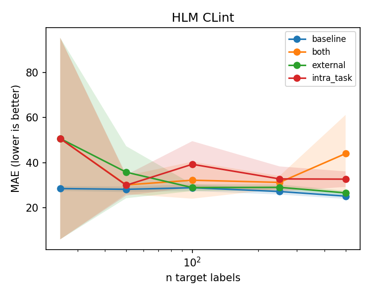 | 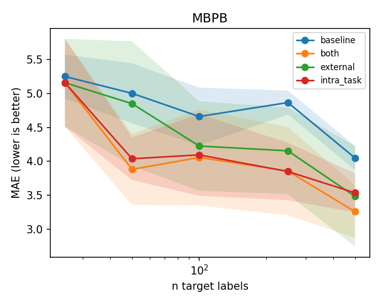 |
| 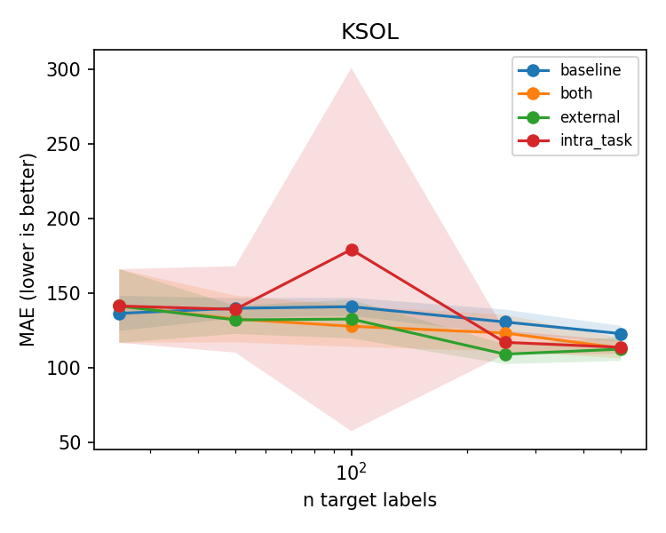 | 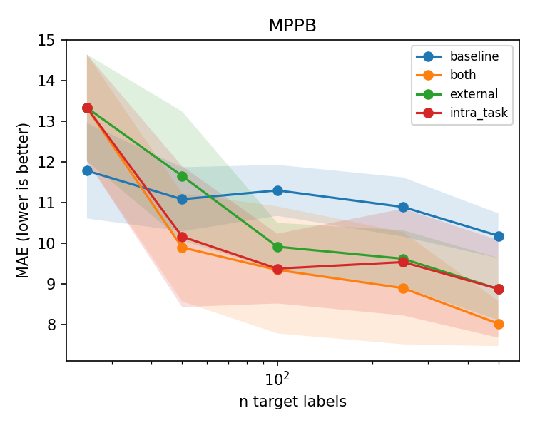 |
| 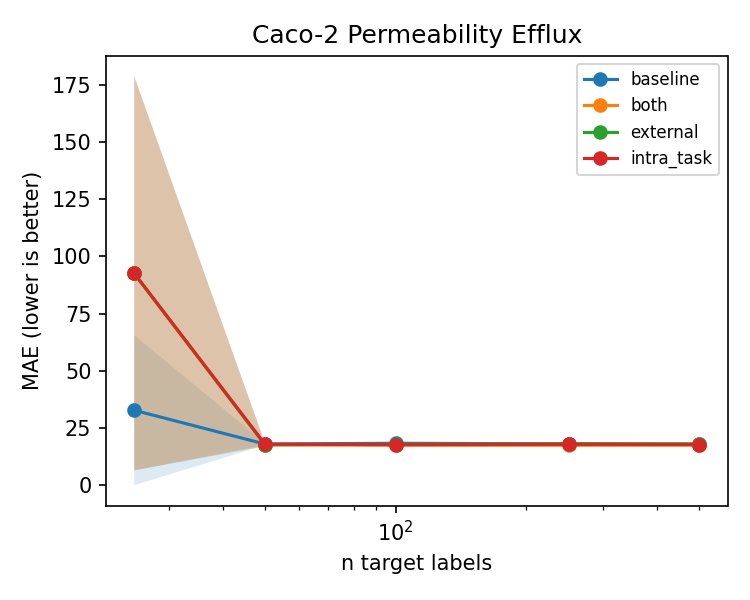 | |

**RMSE (lower is better)**

| | |
|---|---|
| 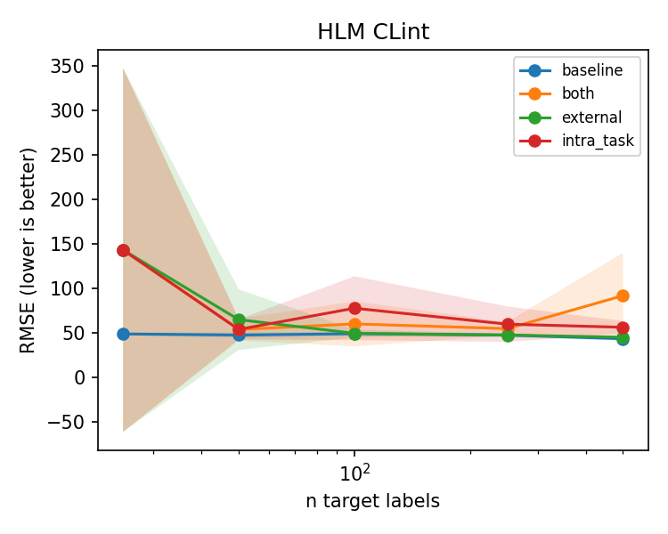 | 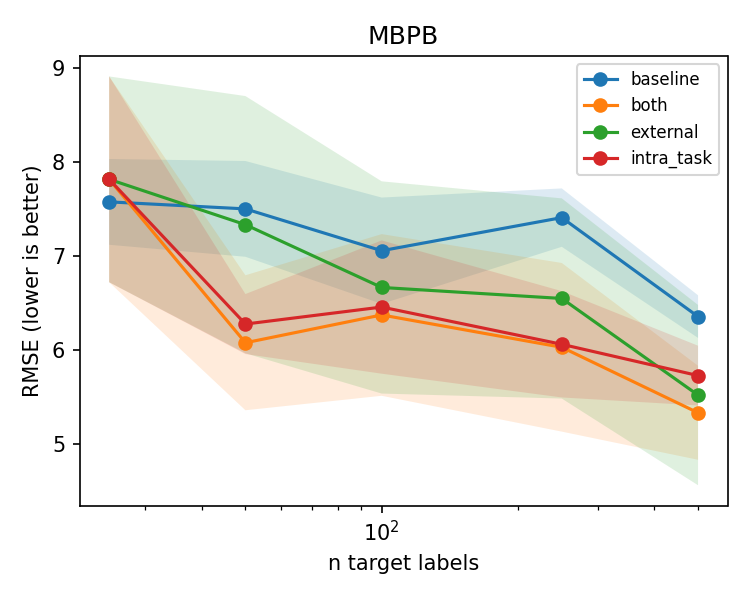 |
| 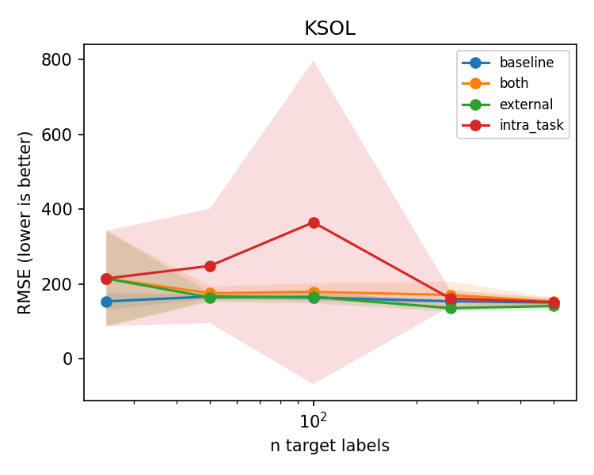 | 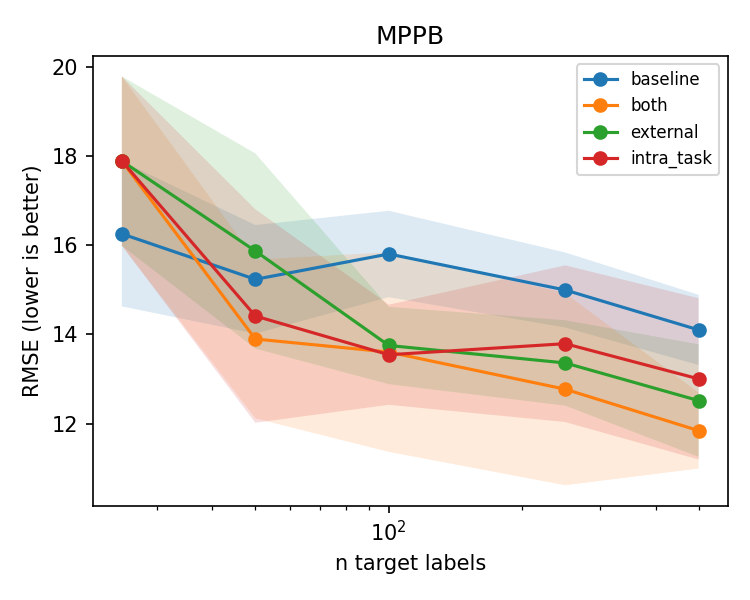 |
| 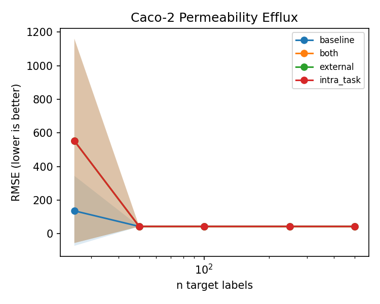 | |

**R² (higher is better)**

| | |
|---|---|
| 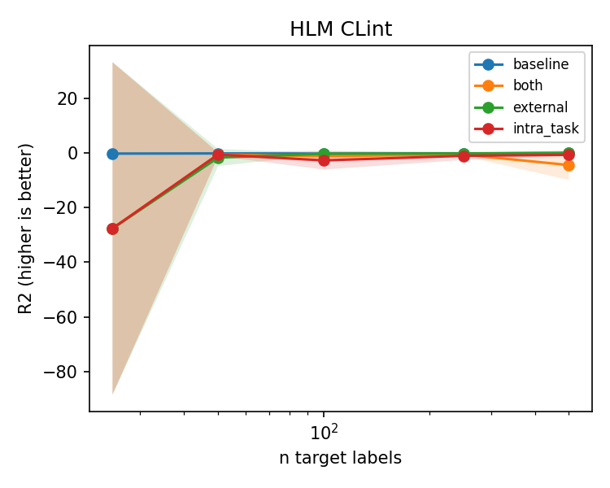 | 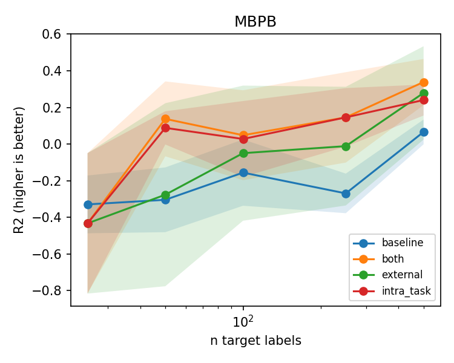 |
| 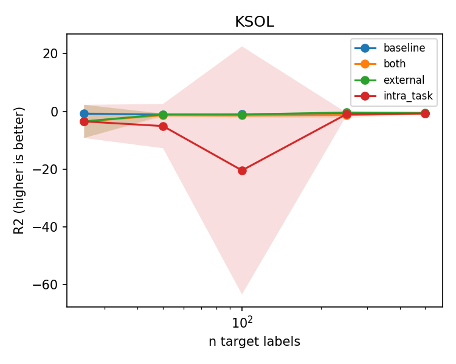 | 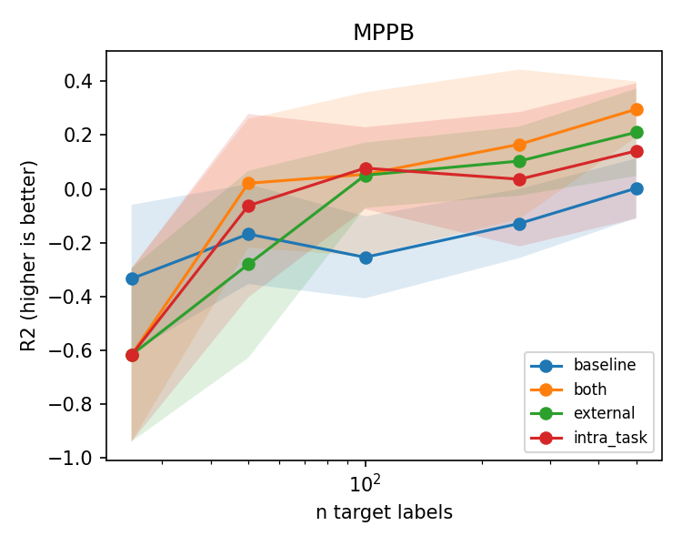 |
| 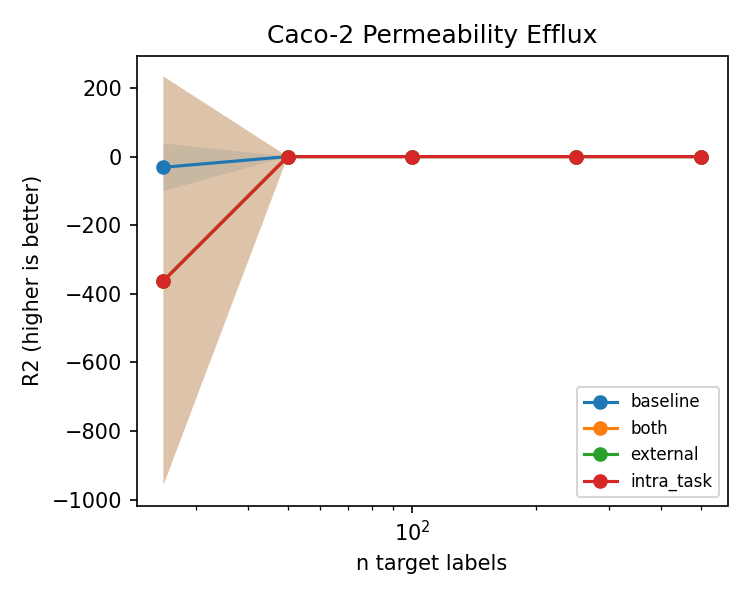 | |

**Spearman ρ (higher is better)**

| | |
|---|---|
| 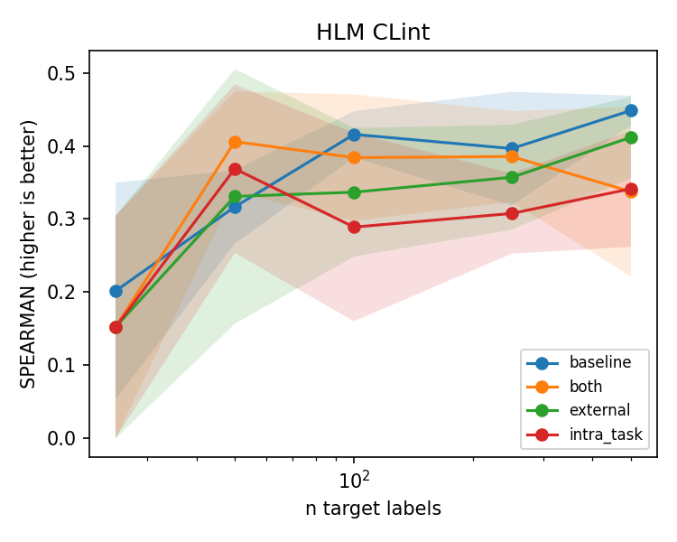 | 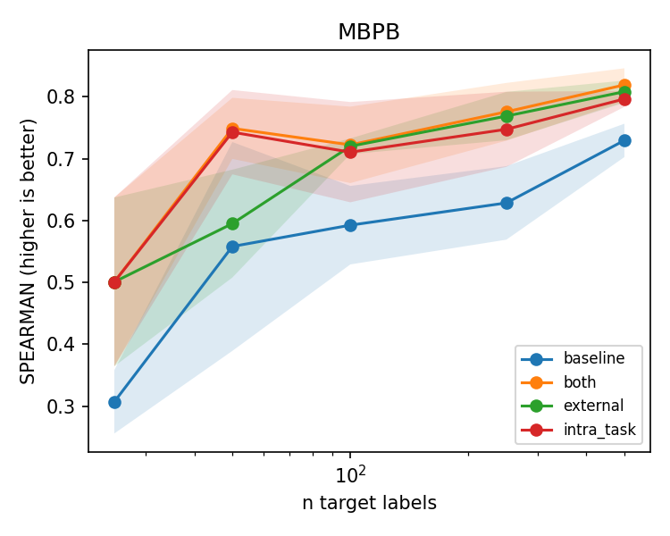 |
| 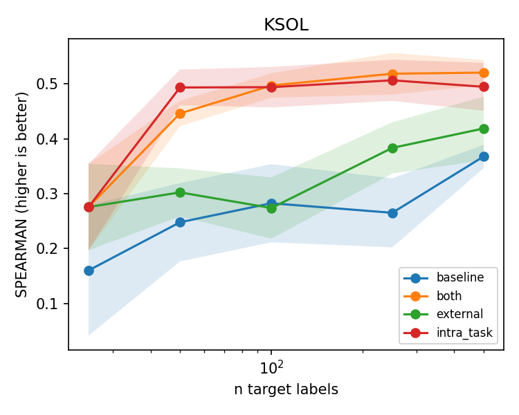 | 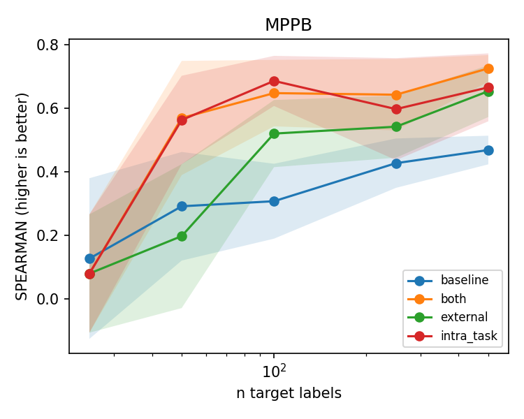 |
| 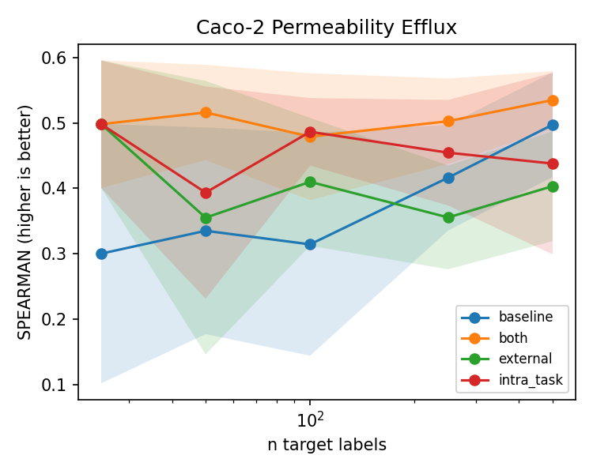 | |

---

## Engineering — Chemprop stability with external data

The first 2-endpoint sweep (`results/`, documented in [RESULTS.md](../RESULTS.md)) initially had
**21/240 NaN cells** on the MBPB `external` arm before these fixes. This full experiment assumes
the patched codebase; without it, sparse `external` arms can return `rae=null` even when training
appears to finish.

| Issue | Fix | Where |
|---|---|---|
| Empty-batch masked multitask loss on sparse pools | Drop all-unlabeled rows in `build_pool()` | `src/agents/data_agent.py` |
| SLURM checkpoint race | `enable_checkpointing=False` | `src/models/chemprop_mt.py` |
| Wrong FFN unscaling | `UnscaleTransform.from_standard_scaler` | `src/models/chemprop_mt.py` |
| LUMI Lightning env | `LightningEnvironment()` plugin | `src/models/chemprop_mt.py` |

Full diagnosis (wrong turns, MBPB `both` vs `external` clue, timeline):
**[CHEMPROP_STABILITY.md](../CHEMPROP_STABILITY.md)**.
