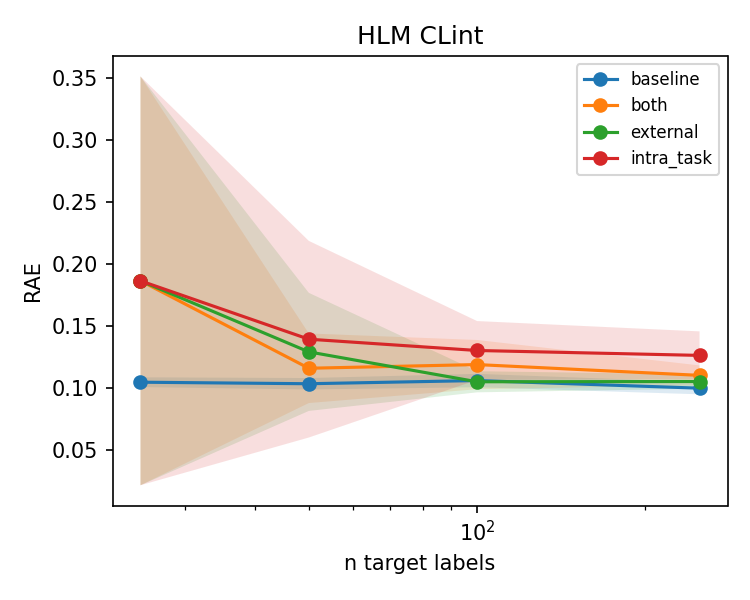
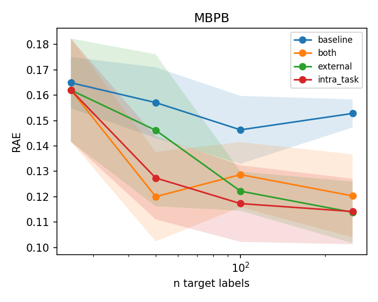
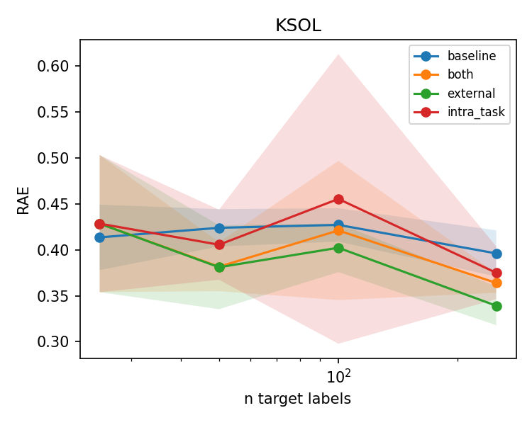

# Experiment — endpoint-exploration rounds (Aitta agent on LUMI)

Run date: 2026-06-06 · LUMI-G · `project_462001520` · **complete (240/240 jobs, 0 NaN)**.
Driver: the agent pipeline (`scripts/run_rounds.sh`), Aitta `openai/gpt-oss-120b` for the agentic
decisions. Companion docs: [OVERVIEW.md](../OVERVIEW.md) (goal), [RESULTS.md](../RESULTS.md)
(prior 2-endpoint sweep), [Readme.md](../Readme.md) (how to run).

## Objective

Map **where auxiliary-data transfer helps few-shot ADMET prediction** by running the same agent
workflow on **three target endpoints chosen for different external-match quality**. The contrast
across endpoints is the deliverable.

Each round runs the full loop: Planner enumerates the sweep → Data agent (Aitta) picks &
harmonizes sources → ML agent (Aitta) picks the mechanism → train + evaluate on the held-out test
→ Planner (Aitta) writes the characterization.

## Design

Three rounds, one endpoint each, **all four arms**, run as **parallel SLURM arrays**:

| Round | Endpoint | External source | Match quality | Hypothesis |
|---|---|---|---|---|
| R1 | `HLM CLint` | Biogen `LOG_HLM_CLint` | **near-identical** | external arm gives the cleanest lift, esp. at small n |
| R2 | `MBPB` | Biogen `LOG_HPPB` (human PPB) | **species-transfer** (weak) | intra-task carries the lift; external muted |
| R3 | `KSOL` | Biogen `LOG_SOLUBILITY` | **protocol-caveat** (µg/mL→µM via MW) | does transfer survive a real harmonization step? |

Arms: `baseline` (LightGBM single-task), `+ intra_task` (Chemprop multitask on ExpansionRx aux
endpoints), `+ external` (multitask on the harmonized external source), `+ both`.

| Axis | Value |
|---|---|
| n target labels | 25, 50, 100, 250 |
| Seeds | 0,1,2,3,4 → mean RAE ± std (error bands) |
| Jobs / round | 4 arms × 4 n × 5 seeds = **80** (240 total) |
| Metric | RAE (range-normalized, native scale; **lower is better**) |
| Models | `baseline`→LightGBM; transfer arms→Chemprop v2 multitask |
| Eval | fixed held-out ExpansionRx test split, scored once |
| LLM | Aitta `openai/gpt-oss-120b`; decisions cached at `results/llm_cache` |

Why **seeds, not repeated runs**: the pipeline is deterministic per seed, so robustness comes from
averaging distinct seeds *within* a sweep; exploration comes from changing the *endpoint* across
rounds.

## Execution

Submitted via `scripts/run_rounds.sh` (`conf/slurm-rounds.yaml`: 3×40 array tasks striding 2 jobs,
concurrency 16; + 3 dependent collect jobs = 123 submitted, under LUMI's ~200 limit). All ran in
parallel and finished cleanly.

| Round | Sweep array | Collect | Output dir |
|---|---|---|---|
| R1 HLM CLint | 19073249 (80) | 19073250 | `results-rounds/hlm/` |
| R2 MBPB | 19073260 (80) | 19073261 | `results-rounds/mbpb/` |
| R3 KSOL | 19073262 (80) | 19073263 | `results-rounds/ksol/` |

---

## R1 — HLM CLint: transfer does **not** help



Mean RAE over 5 seeds (lower is better; **best per n** in bold):

| n | baseline | intra_task | external | both |
|---:|---:|---:|---:|---:|
| 25 | **0.1050** | 0.1866 | 0.1866 | 0.1866 |
| 50 | **0.1037** | 0.1396 | 0.1294 | 0.1162 |
| 100 | **0.1063** | 0.1305 | 0.1053 | 0.1192 |
| 250 | **0.1002** | 0.1266 | 0.1055 | 0.1105 |

At n=250: baseline 0.100±0.005, external 0.106±0.006 (overlaps baseline), `intra_task`
0.127±0.019 (**significantly worse** — band sits above baseline). The near-identical external
assay only *catches up* to baseline by n≥100; it never beats it, and adding the ExpansionRx
auxiliaries (`intra_task`) actively hurts. **A data-rich endpoint with a strong own signal gains
nothing from transfer** — and naive multitasking adds noise.

## R2 — MBPB: transfer **clearly helps**, carried by intra-task



| n | baseline | intra_task | external | both |
|---:|---:|---:|---:|---:|
| 25 | 0.1649 | **0.1620** | 0.1620 | 0.1620 |
| 50 | 0.1571 | 0.1274 | 0.1462 | **0.1200** |
| 100 | 0.1463 | **0.1173** | 0.1222 | 0.1287 |
| 250 | 0.1528 | **0.1142** | 0.1139 | 0.1203 |

At n=250: baseline 0.153±0.006 vs `intra_task` 0.114±0.013 and `external` 0.114±0.012 — bands well
separated, a **~0.039 absolute (~25%) reduction**. The lift appears from n≥50 and is driven mainly
by the in-distribution ExpansionRx auxiliary endpoints (`intra_task`); the weak human-PPB external
proxy also helps from n≥100. **A sparse endpoint with no strong external match benefits most from
borrowing related in-house tasks** — matching the full-sweep finding in RESULTS.md.

## R3 — KSOL: hard endpoint; the **harmonized external** source gives a modest edge



| n | baseline | intra_task | external | both |
|---:|---:|---:|---:|---:|
| 25 | **0.4136** | 0.4286 | 0.4286 | 0.4286 |
| 50 | 0.4240 | 0.4056 | **0.3811** | 0.3817 |
| 100 | **0.4272** | 0.4555 | 0.4023 | 0.4211 |
| 250 | 0.3961 | 0.3750 | **0.3392** | 0.3640 |

KSOL is intrinsically hard (RAE ≈ 0.4 for all arms). At n=250: baseline 0.396±0.025 vs `external`
0.339±0.021 — a **~0.057 absolute (~14%) reduction**, bands just non-overlapping. Here `external`
is the **best** arm (opposite of MBPB), so the Biogen solubility source **transfers usefully even
through a real µg/mL→µM unit harmonization**, while `intra_task` is noisy (high variance at n=100).

> ⚠️ The Aitta narrative in `ksol/report.md` mislabels this external n=250 result as a
> "degradation" — it confused lower-is-better RAE direction. The deterministic tables/curves
> above are authoritative: external is the best arm. (Documented as a reminder to sanity-check LLM
> prose against the numbers.)

---

## Cross-round synthesis

| Endpoint | External match | Best arm @ n=250 | Lift vs baseline | Verdict |
|---|---|---|---:|---|
| HLM CLint | near-identical | **baseline** (0.100) | none (transfer ≥ baseline) | transfer doesn't help |
| MBPB | weak species proxy | `intra_task`/`external` (0.114) | **−0.039 (~25%)** | intra-task wins |
| KSOL | needs harmonization | `external` (0.339) | **−0.057 (~14%)** | external wins |

**Headline:** external-match *label* quality does **not** predict where transfer helps. The
biggest lifts are where the **baseline is weakest relative to the available auxiliary signal**
(MBPB, KSOL), not where the external assay is most identical (HLM). And *which* source helps is
endpoint-specific: in-house multitask for MBPB, the harmonized external dataset for KSOL, neither
for HLM. This is exactly the "when does transfer help, and from what" characterization the
workflow is built to produce.

## Caveats

- n=25 is high-variance for every endpoint; conclusions there are not robust.
- The numeric tables/plots are always the ground truth; the LLM narrative is a written summary on
  top of them.

### Fixes applied after the first collect (both standalone)

1. **Self-describing report header.** `collect` now reconstructs the plan from each results dir's
   own `manifest.jsonl` (`plan_from_manifest`, `src/experiment/runner.py`), so headers always match
   what was actually run — no dependency on which plan YAML is the default. Earlier single-endpoint
   reports had a generic "Endpoints: HLM CLint, MBPB …" header; all three were regenerated and now
   read the correct single endpoint.
2. **Metric direction in the narrative.** The Aitta narrative prompt now states RAE is
   lower-is-better and must not be called RMSE/R² (`src/agents/llm_overrides.py`), with a bumped
   cache key so it regenerates. The KSOL narrative previously mislabeled the external lift as a
   "degradation"; it now correctly reports a −14.4% improvement.

## Reproduce

```bash
# token (24h): https://aitta-auth.csc.fi/myToken  ->  conf/.aitta_token
bash scripts/run_rounds.sh --dry-run     # render scripts, submit nothing
bash scripts/run_rounds.sh               # submit all 3 rounds (arrays + dependent collect)
squeue -u $USER                          # monitor
```

Per-round artifacts: `results-rounds/<hlm|mbpb|ksol>/{results.parquet,curves.png,ma_rae.png,report.md,runs/}`.
Configs: `conf/round1-hlm.yaml`, `conf/round2-mbpb.yaml`, `conf/round3-ksol.yaml`,
`conf/slurm-rounds.yaml`.
