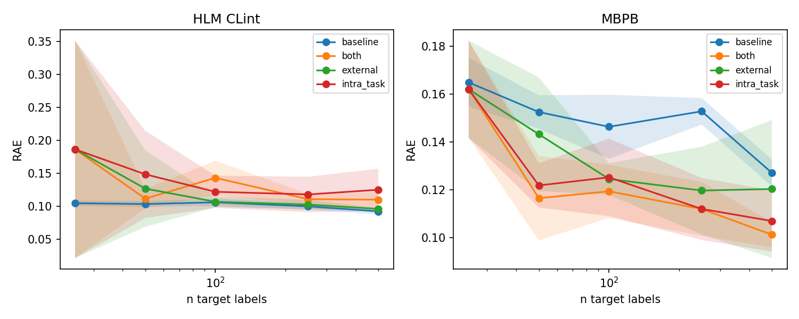
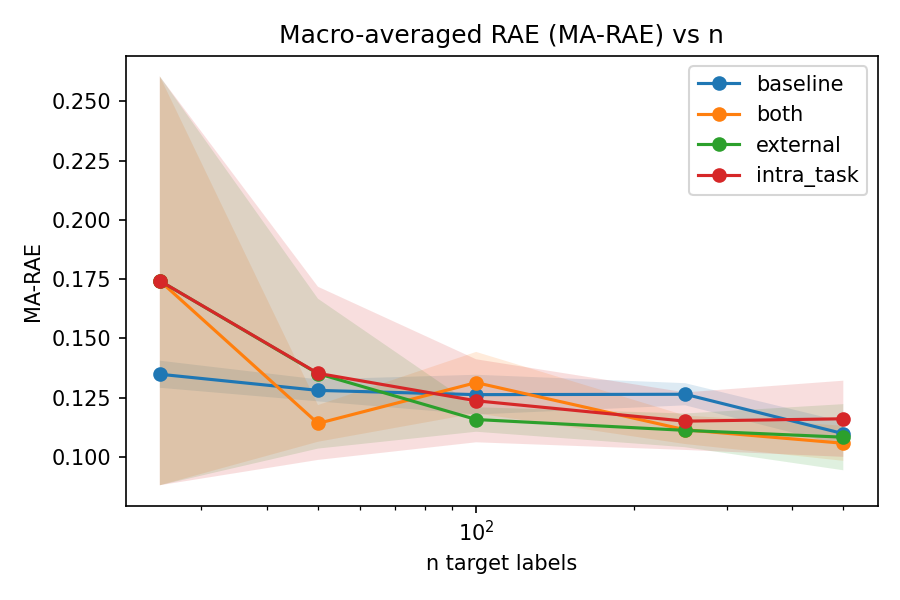

# MVP experiment — 2-endpoint ADMET transfer study (LUMI)

Run date: 2026-06-05/06 · LUMI-G · `project_462001520` · **complete (240/240 jobs, 0 NaN)**.
This is the first full sweep in `results/` — the Plan.md MVP (M4 contrast endpoints). Companion
docs: [OVERVIEW.md](../OVERVIEW.md), [RESULTS.md](../RESULTS.md) (summary), [Readme.md](../Readme.md).
Follow-on studies: [results-rounds/EXPERIMENT.md](../results-rounds/EXPERIMENT.md),
[results-fullexp/EXPERIMENT.md](../results-fullexp/EXPERIMENT.md).

## Project context

**Thesis.** For a sparse target ADMET endpoint, auxiliary training data from (a) richer ExpansionRx
endpoints (cross-task) and (b) external ADMET datasets (cross-dataset) lowers prediction error most
in the low-data regime, and the size of that lift depends on how well the auxiliary assay matches the
target. We demonstrate this with subsampled learning curves and characterize the pattern.

**System.** A deterministic toolset (data harmonization → Chemprop v2 multitask / LightGBM baseline →
RAE evaluation) with an optional Aitta LLM layer for the collect narrative. The data pipeline
curates and **harmonizes** target + auxiliary sources; evaluation matches the OpenADMET–ExpansionRx
challenge: **RAE / MA-RAE** on the official time-split, with the held-out test touched once at
scoring.

**This run** is the first end-to-end characterization on the two endpoints chosen in Plan.md §0 as
the MVP contrast: `HLM CLint` (data-rich, near-identical external assay) vs. `MBPB` (sparse, weak
external proxy only). Full build spec: [../Plan.md](../Plan.md).

## Objective

Establish whether auxiliary-data transfer helps few-shot ADMET prediction on a **strong-external-match
endpoint** (HLM CLint) versus a **sparse endpoint with only a weak cross-species proxy** (MBPB).
Each endpoint gets a full sweep (4 arms × 6 data sizes × 5 seeds) to produce the first credible
learning curves and the contrast that motivated later multi-endpoint studies.

## Design

Two target endpoints in a **single combined sweep** (one SLURM array + dependent collect):

| Endpoint | Labels (train) | External source | Match quality |
|---|---:|---|---|
| `HLM CLint` | 3759 | Biogen `LOG_HLM_CLint` | near-identical |
| `MBPB` | 975 | Biogen `LOG_HPPB` (human PPB) | species-transfer (weak) |

Arms: `baseline` (LightGBM single-task), `+ intra_task` (Chemprop multitask on ExpansionRx aux
endpoints), `+ external` (multitask on the harmonized external source), `+ both`.

| Axis | Value |
|---|---|
| n target labels | 25, 50, 100, 250, 500, **full** |
| Seeds | 0,1,2,3,4 → mean RAE ± std |
| Jobs | 2 × 4 × 6 × 5 = **240** |
| Metric | RAE (range-normalized, native scale; **lower is better**) |
| Models | `baseline`→LightGBM; transfer arms→Chemprop v2 multitask |
| Eval | fixed held-out ExpansionRx test split, scored once |
| LLM | Aitta `openai/gpt-oss-120b` for collect narrative; cache at `results/llm_cache` |

## Execution / SLURM

Launched with `scripts/run_full_sweep.sh` using `conf/sweep.yaml` and `conf/slurm.yaml`
(`array_concurrency: 64`, `max_array_tasks: 150`). The first submission (`admet-sweep`) hit Chemprop
stability issues on sparse arms; the final clean rerun used job name `admet-rerun`.

| Phase | Sweep | Collect (afterany) | Output |
|---|---|---|---|
| Final successful run | 19072717 | 19072718 | `results/` |

**Disconnection-safe:** the launcher only submits, then exits; SLURM runs the sweep and the chained
collect job independently of any login session.

---

## Step-by-step reproduction (copy-paste)

Run from the project root on a **LUMI login node**.

```bash
# 0) One-time: get a 24h Aitta token from https://aitta-auth.csc.fi/myToken
echo 'PASTE_YOUR_TOKEN_HERE' > conf/.aitta_token && chmod 600 conf/.aitta_token

# 1) (optional) Quick 8-job sanity check first
bash scripts/run_full_sweep.sh --mini --dry-run
bash scripts/run_full_sweep.sh --mini

# 2) Preview the full 240-job sweep — renders sbatch scripts, submits nothing
bash scripts/run_full_sweep.sh --dry-run

# 3) Launch the full sweep (disconnection-safe)
bash scripts/run_full_sweep.sh --yes
#    ...or with confirmation prompt:  bash scripts/run_full_sweep.sh

# 4) Monitor (any time, from any session)
squeue -u $USER
bash scripts/check_status.sh

# 5) Read the result when the collect job finishes
cat results/report.md

# 6) (only if needed) re-aggregate plots/report without re-training
RESULTS_DIR=results bash scripts/submit_collect.sh
```

Config files for this experiment: `conf/sweep.yaml`, `conf/slurm.yaml`, launcher
`scripts/run_full_sweep.sh`. For a smaller preflight plan: `conf/sweep-mini.yaml`.

Outputs: `results/{results.parquet, curves.png, ma_rae.png, report.md, runs/}`.

---

## Results

All 240 jobs completed (no failures). Tables show **mean RAE ± std over 5 seeds** (lower is
better); **bold** = best arm at that data size. Arms: `+intra` = ExpansionRx multitask,
`+external` = Biogen multitask, `+both` = both auxiliary sources.

### HLM CLint — baseline best at every n



| n | baseline | +intra | +external | +both |
|---|---|---|---|---|
| 25 | **0.105±0.004** | 0.187±0.147 | 0.187±0.147 | 0.187±0.147 |
| 50 | **0.104±0.004** | 0.149±0.059 | 0.127±0.052 | 0.112±0.013 |
| 100 | **0.106±0.005** | 0.122±0.022 | 0.107±0.007 | 0.143±0.023 |
| 250 | **0.100±0.004** | 0.118±0.024 | 0.103±0.006 | 0.111±0.007 |
| 500 | **0.093±0.004** | 0.125±0.029 | 0.096±0.002 | 0.110±0.010 |
| full | **0.085±0.001** | 0.103±0.006 | 0.088±0.004 | 0.100±0.005 |

Single-task LightGBM wins at **every** size. The near-identical Biogen HLM assay never beats
baseline; adding ExpansionRx auxiliaries (`+intra`) actively hurts. **Negative result** — transfer
is the wrong move on a data-rich endpoint with a strong own signal.

### MBPB — transfer wins from n ≥ 50

| n | baseline | +intra | +external | +both |
|---|---|---|---|---|
| 25 | 0.165±0.009 | **0.162±0.018** | 0.162±0.018 | 0.162±0.018 |
| 50 | 0.153±0.006 | 0.122±0.008 | 0.143±0.021 | **0.117±0.016** |
| 100 | 0.146±0.012 | 0.125±0.015 | 0.125±0.006 | **0.119±0.010** |
| 250 | 0.153±0.005 | **0.112±0.012** | 0.120±0.016 | **0.112±0.010** |
| 500 | 0.127±0.005 | 0.107±0.011 | 0.120±0.026 | **0.101±0.005** |
| full | 0.121±0.010 | 0.098±0.003 | 0.096±0.018 | **0.093±0.005** |

Transfer reduces RAE by ~0.03–0.04 (≈25–35% relative) once n ≥ 50, with separated bands at
n = 250 and 500. Most of the lift comes from in-distribution ExpansionRx auxiliaries (`+intra`);
`+both` leads in the few-shot/mid regime; `+external` is best at full data.

### Macro-averaged RAE (both endpoints)



### Cross-endpoint synthesis

Best transfer arm vs. baseline (negative % = transfer worse; positive = transfer better):

| Endpoint | Labels | few-shot (n=50) | full data |
|---|---:|---|---|
| HLM CLint | 3759 | +both **−7.7%** (baseline wins) | +external **−3.5%** (baseline wins) |
| MBPB | 975 | +both **+23.5%** | +both **+23.1%** |

**Takeaways**

1. **The contrast is real.** Transfer helps on the sparse endpoint (MBPB) and does not on the
   data-rich one (HLM CLint) — exactly the MVP hypothesis from Plan.md §0.
2. **External-match label quality does not guarantee transfer.** HLM has a near-identical external
   assay yet baseline wins; MBPB has only a weak human-PPB proxy yet transfer delivers large gains.
3. **Intra-task ExpansionRx co-training carries most of the MBPB lift.** `+both` ≈ `+intra` at high
   n; the external source adds value mainly at full data.
4. **n=25 is unreliable** for both endpoints — transfer arms collapse to nearly identical values.
   Treat few-shot conclusions at n=25 with caution.

**Recommendation:** use `+both` or `+intra` for MBPB; use the plain single-task baseline for
HLM CLint. The machine-generated narrative is in [`report.md`](report.md).

## Engineering notes (issues found and fixed during this run)

These were uncovered while getting the sweep to 240/240 clean:

1. **Empty-batch NaN (root cause of MBPB `external` failures).** Sparse arms kept ExpansionRx rows
   with no label in any task column; under masked multi-task loss, empty batches produced `0/0 = NaN`.
   Fix: the data agent drops fully-unlabeled rows (`src/agents/data_agent.py`).
2. **Shared-checkpoint race.** Concurrent array tasks writing Lightning checkpoints into one dir
   raced (`FileNotFoundError`). Fix: `enable_checkpointing=False` on the trainer (`src/models/chemprop_mt.py`);
   also fixed FFN `output_transform` and pinned `LightningEnvironment` for Cray/PMI.
3. **Training-stability margin.** Lowered Chemprop `max_lr` 1e-3 → 2e-4 for headroom on sparse pools.
4. **LLM narrative robustness.** Bumped `max_tokens` 1024 → 8192 and graceful fallback when Aitta
   returns empty JSON (`src/agents/llm.py`, `src/agents/llm_overrides.py`).

Details: [CHEMPROP_STABILITY.md](../CHEMPROP_STABILITY.md).

## What came next

This MVP established the HLM-vs-MBPB contrast. Follow-on work extended it:

| Study | Scope | Doc |
|---|---|---|
| `results-rounds/` | 3 endpoints (HLM, MBPB, KSOL), agent loop, n≤250 | [EXPERIMENT.md](../results-rounds/EXPERIMENT.md) |
| `results-fullexp/` | 5 endpoints, full n grid, agent loop | [EXPERIMENT.md](../results-fullexp/EXPERIMENT.md) |
| `further-improvements/` | `pretrain_finetune`, official RAE, significance tests | [EXPERIMENT.md](../further-improvements/EXPERIMENT.md) |

## Alternative metrics (not just RAE)

Every run stores **`rae`, `mae`, `rmse`, `r2`, `spearman`** in `results.parquet`, so other views
need **no re-training**. Regenerate plots + report for any metric:

```bash
RESULTS_DIR=results METRIC=r2 bash scripts/submit_collect.sh   # SLURM
# or inside the container:
python -m experiment.cli collect --results-dir results --metric r2   # rae|mae|rmse|r2|spearman
```

A different *RAE definition* is pluggable (`range_normalized` default, `vs_mean`, or `official`)
via `rae_definition` in `src/eval/metrics.py`.
